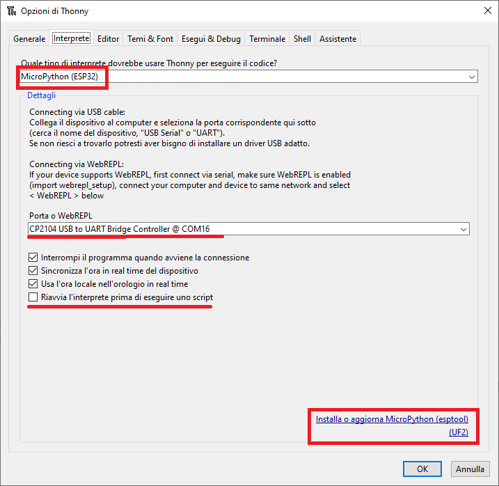
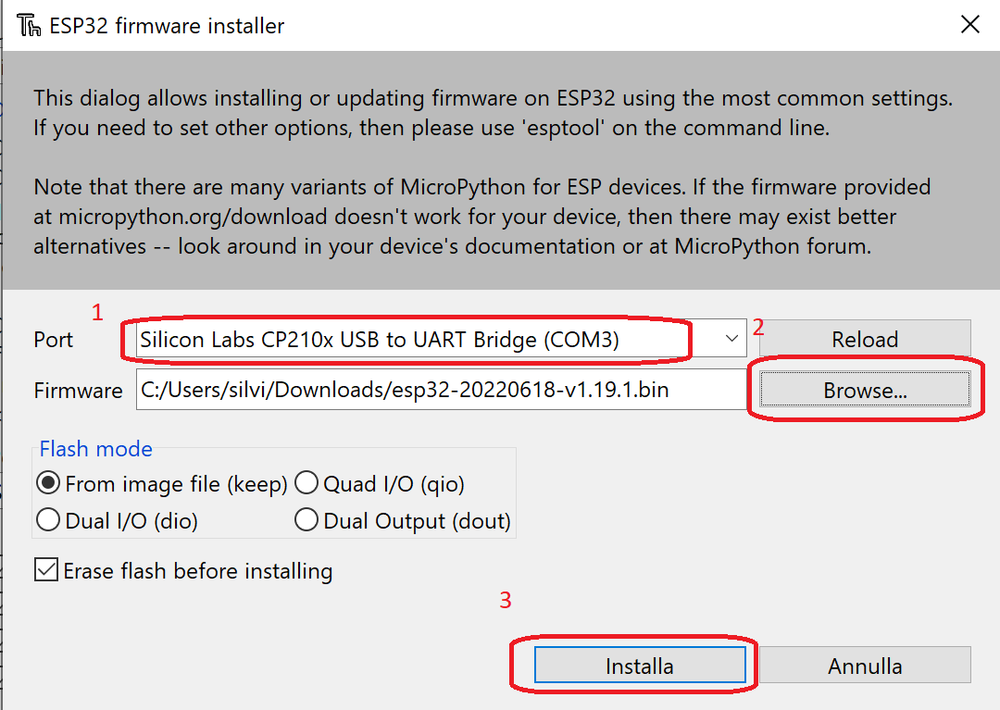
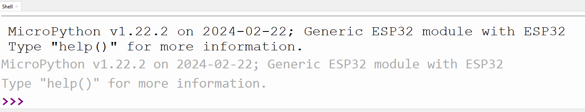
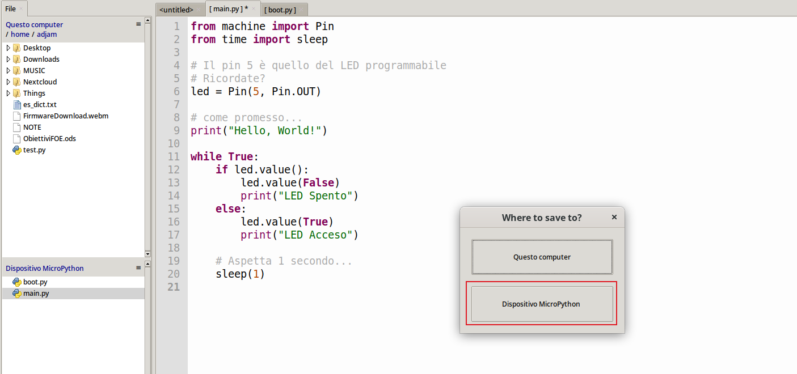

# Prime Operazioni


In questo capitolo installeremo il firmware MicroPython su ESP32 e faremo un primo test di funzionamento. 
L'obiettivo di questo capitolo è essere operativi... le spiegazioni sul codice (Micro)Python e il dispositivo ESP32... arrivano dopo!


## Installazione Firmware

Per caricare il firmware MicroPython Thonny offre una comodissima interfaccia, che ci permette di scaricarlo e installarlo automaticamente!!!

Se invece volete curiosare sul sito ufficiale MicroPython:

- Aprite il link <a href="https://micropython.org" target="_blank">MicroPython</a>;
- Cliccate sulla voce `Download`;
- Scendete sull'elenco dei microcontrollori fino a trovare `ESP32 / WROOM - EspressIf`
- Verificate l'ultima ***Firmware release*** disponibile  (l'ultima volta che ho guardato, la versione `v1.22.2`)

Adesso un attimo di riposo... siete praticamente già ad un terzo del lavoro!!!

La seconda fase consiste semplicemente nel collegare il microcontrollore ESP32 al nostro computer tramite un cavo USB.<br>
Mi immagino che siate già riusciti nell'impresa... pronti per l'ultima fase:

- Aprite `Thonny`
- Dal menù `ESEGUI`, seleziona `CONFIGURA L'INTERPRETE`
- Seleziona `MicroPython (ESP32)` (vedi figura sotto)

<br>



<br>

!!! note "La giusta porta COM"

    Come vedete in figura, la MCU utilizza una porta COM supportata dal driver **Silicon Labs CP210x USB to UART Bridge**.
    
    Se nel tuo computer manca... chiedi al prof!!!

<br>

- Adesso selezionate `Installa o Aggiorna MicroPython`
- Si aprirà la finestra qui sotto. Vanno selezionate:
    
    - la porta su cui è collegata il microcontrollore ESP32
    - La famiglia della MCU (ESP32)
    - La variante (EspressIf - ESP32 / WROOM)
    - la versione (dovrebbe apparire automaticamente l'ultima installabile)

- Poi clicca `installa`

<br>



<br>

!!! tip "... attendi fiducioso un minutino buono..."
    
    Al termine della procedura dovrebbe apparire l'interprete MicroPython nella shell di Thonny

<br>



<br>

Ecco fatto!

Siamo pronti per il primo esempio!


## Primo programma

Di solito i primi programmi che si scrivono testando un nuovo ambiente sono i famigerati HelloWorld! In questo caso particolare invece, andremo
ad accendere e spegnere (ad intervalli programmati) il led fisico (detto, appunto, *programmabile*) disponibile nell'ESP32.

Il programma scriverà inoltre su `REPL` una notifica del tipo "*LED Acceso*" o "*LED Spento*".


!!! note "REPL"
    `Read Eval Print Loop` è una caratteristica tipica dei linguaggi interpretati che forniscono accesso all'interprete da console.
    In Python REPL viene identificato dai 3 maggiori `>>>` ed è effettivamente un punto di accesso all'interprete stesso. 
    
    Tu scrivi un comando, lui lo legge (Read), lo valuta (Eval), visualizza un output come risultato della sua valutazione (Print) e infine ripresenta
    il prompt iniziale `>>>` (Loop).


Il programma ci serve come esempio per prendere confidenza con i mondi MicroPython ed ESP32: non è importante adesso quello che fa il programma, 
ma riuscire a capire tutte le operazioni da svolgere. Per questo ho deciso di dividere le operazioni in step successivi. Andiamo!!

**Step 0**

Se non lo hai già fatto, connetti il tuo ESP32 al computer, apri Thonny e cambia l'interprete Python a `MicroPython (ESP32)`.

**Step 1**

Copia su Thonny il seguente codice:

``` py
from machine import Pin
from time import sleep

# Il pin 5 è quello del LED programmabile
# Ricordate?
led = Pin(5, Pin.OUT)
led.off()

while True:
    led.on()
    print("LED Acceso")
    sleep(1)
    led.off()
    print("LED Spento")
    sleep(1)
```

**Step 2**

Adesso salva il file come `led_test.py` dentro la memoria dell'ESP32. Per farlo:

- clicca SALVA
- Dall'interfaccia seleziona *Dispositivo MicroPython*

<br>



<br>

- Salva il file nella MCU con nome `led_test.py` o come preferisci.

**Step 3**

Esegui il codice, premendo `F5` oppure selezionando l'azione `Run current script`: dovresti vedere le scritte `LED Spento` e `LED Acceso` alternate di un secondo
mentre il LED si accende e si spegne.

Ecco fatto!


## "boot.py" e "main.py"


Sicuramente avrai notato che nel filesystem dell'ESP32 è presente un file chiamato "boot.py". Questo file viene eseguito automaticamente... al boot del dispositivo.
Quindi il poco codice che va lì dentro può servire per le prime indispensabili operazioni irrinunciabili: collegarsi ad una rete wifi, attivare il bluetooth, far partire webrepl (qualunque cosa esso sia)...

Se invece dovete eseguire un codice, salvate il vostro file con il nome "main.py". Questo, rispetto a copiare il codice nel file "boot.py" presenterà diversi vantaggi:

- sarà eseguito subito dopo il boot, ovvero quando il dispositivo è già pienamente funzionante.
- sarà possibile collegarsi al dispositivo tramite (web)repl e stoppare/far ripartire il main senza dover riavvare tutto il dispositivo.
- blah blah (è meglio e basta! Se devi far partire codice all'avvio del dispositivo, mettilo in un file main.py)


<br>
<br>
<br>

