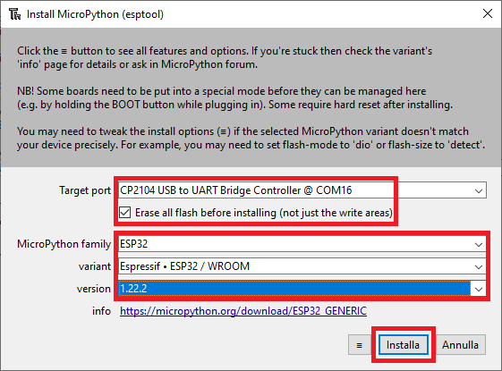

# Prime Operazioni


In questo capitolo installeremo il firmware MicroPython su ESP32 e faremo un primo test di funzionamento. L'obiettivo di questo capitolo è essere operativi... le spiegazioni sul codice (Micro)Python e il dispositivo ESP32... arrivano dopo!


## Installazione Firmware

Per caricare il firmware MicroPython occorre prima scaricarlo dal sito ufficiale!

- Aprite il sito ufficiale <a href="https://micropython.org" target="_blank">MicroPython</a>;
- Cliccate sulla voce `Download`;
- Scendete sull'elenco dei microcontrollori fino a trovare `ESP32 - EspressIf`
- Scaricate l'ultimo file binario disponibile fra le `Firmware Releases` (l'ultima volta che ho guardato, la versione `v1.19.1`)

Adesso un attimo di riposo... siete praticamente già ad un terzo del lavoro!!!

La seconda fase consiste semplicemente nel collegare il microcontrollore ESP32 al nostro computer tramite un cavo USB.<br>
Mi immagino che siate già riusciti nell'impresa... pronti per l'ultima fase:

- Aprite `Thonny`
- Dal menù `ESEGUI`, seleziona `CONFIGURA L'INTERPRETE`
- Seleziona `MicroPython (ESP32)` (vedi figura sotto)

<br>


<br>

- Adesso selezionate `Installa o Aggiorna MicroPython`
- Si aprirà la finestra qui sotto. Vanno selezionate:
    
    - la porta su cui è collegata il microcontrollore ESP32
    - il file del firmware da installare

- Poi clicca `installa`

<br>



<br>

- ... attendi fiducioso un minutino buono...
- ...
- Al termine della procedura dovrebbe apparire l'interprete MicroPython nella shell di Thonny

<br>


<br>

Ecco fatto!

Siamo pronti per il primo esempio!


## "Hello, World!" con ESP32 e MicroPython

Tecnicamente questo... non è un HelloWorld program... nel senso che non scriveremo "Hello, World!", ma faremo accendere e spegnere un led.
Ok... capisco la delusione: aggiungerò in cima la scritta "Hello, World!" e, ad ogni accensione o spegnimento scriverò una notifica del tipo
"LED Acceso" o "LED Spento".

Il programma ci serve come esempio per prendere confidenza con i mondi MicroPython ed ESP32: non è importante adesso quello che fa il programma, 
ma riuscire a capire tutte le operazioni da svolgere. Per questo ho deciso di dividere le operazioni in step successivi. Andiamo!!

**Step 0**

Se non lo hai già fatto, connetti il tuo ESP32 al computer, apri Thonny e cambia l'interprete Python a `MicroPython (ESP32)`.

**Step 1**

Copia su Thonny il seguente codice:

``` py
from machine import Pin
from time import sleep

# Il pin 5 è quello del LED programmabile
# Ricordate?
led = Pin(5, Pin.OUT)

# come promesso...
print("Hello, World!")

while True:
    if led.value():
        led.value(False)
        print("LED Spento")
    else:
        led.value(True)
        print("LED Acceso")
    
    # Aspetta 1 secondo...
    sleep(1)
```

**Step 2**

Adesso salva il file come `led_test.py` dentro la memoria dell'ESP32. Per farlo:

- clicca SALVA
- Dall'interfaccia seleziona *Dispositivo MicroPython*

<br>


<br>

- Salva il file nella MCU con nome `led_test.py` o come preferisci.

**Step 3**

Esegui il codice, premendo `F5` oppure selezionando l'azione `Run current script`: dovresti vedere PRIMA la scritta `Hello, World!` e poi alternate
di un secondo le scritte `LED Spento` e `LED Acceso` mentre il LED si accende e si spegne.

Ecco fatto!

!!! tip "Il file boot.py"

    Se hai notato, è presente anche un file `boot.py` nella memoria del dispositivo. Questo file contiene solo codice commentato. Il file viene 
    eseguito automaticamente... al boot del dispositivo.
    
    Ritornerà utile usarlo per fare l'import di altri files (ed eseguirli automaticamente al boot) oppure per scriverci direttamente il codice da
    eseguire.

<br>
<br>
<br>

