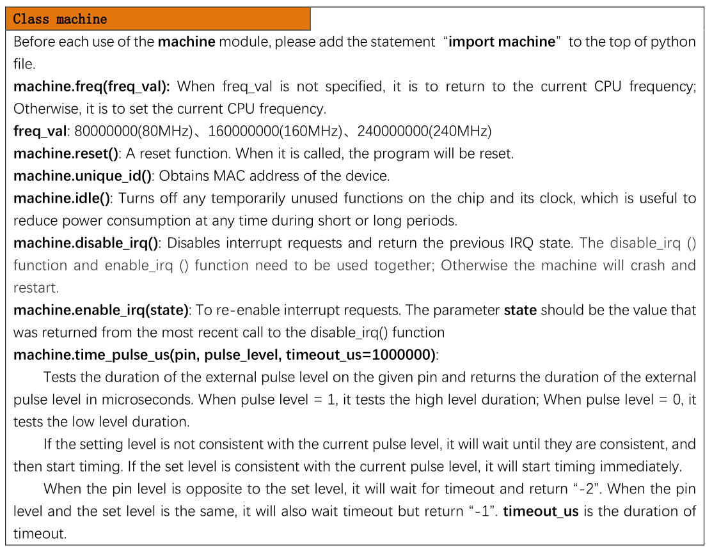
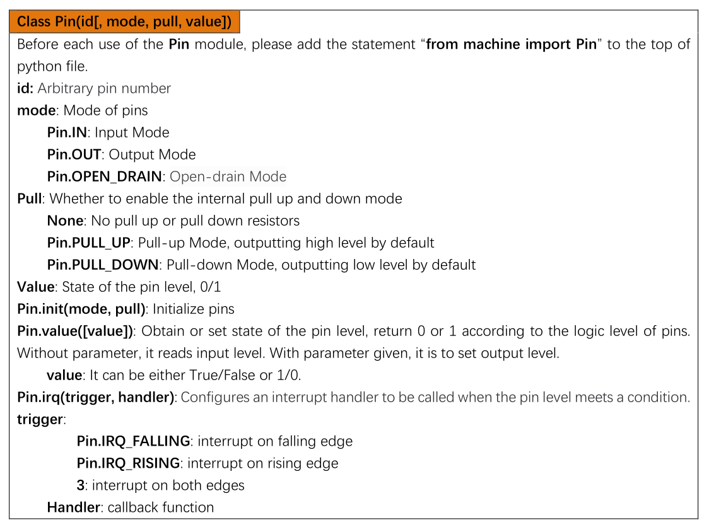
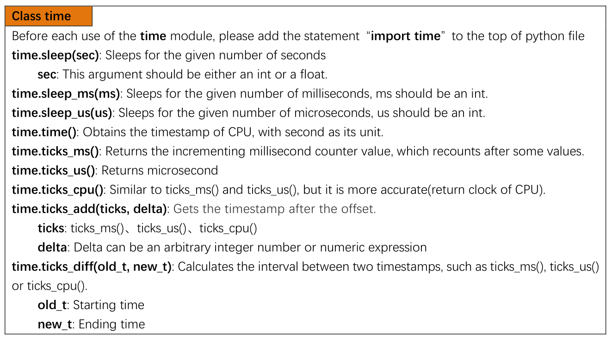

# MicroPython 

Come abbiamo già detto, MicroPython è un interprete progettato appositamente per i microcontrollori e che cerca di emulare le funzionalità
base di Python. Sostanzialmente sono implementati due gruppi di funzionalità:

- alcune delle funzionalità base di python, come le librerie `math`, `time`, `array`, `random`, etc...
- alcune funzionalità specifiche per i microcontrollori, organizzate nelle librerie `bluetooth`, `esp`, `esp32`, `machine`, `network`, etc..

Ovviamente le risorse hardware disponibili sono molto limitate, ma le funzionalità implementate ricalcano perfettamente il comportamento delle
librerie della `Python Standard Library`.

!!! note "Alias Predefiniti"

    A dire la verità... i moduli MicroPython che reimplementano funzionalità della **Python Standard Library** iniziano tutti per `u` 
    (che assomiglia a `µ` (micro) dell'alfabeto greco antico): `utime`, `umath`, `urandom`, etc...  
    Però hanno tutti un alias predefinito che li riporta al nome della Libreria Python Standard originale.
    
    Quindi potete scrivere senza problemi, sia `import utime` che `import time` :smile:
    

La cosa interessante su cui spendere un pò di tempo sono sicuramente le librerie specifiche per i microcontrollori. In questo momento però, 
la cosa più corretta mi sembra solo quella di aggiungere per ognuna una breve descrizione ed il link alla documentazione ufficiale.

A proposito... qui trovate la <a href="https://docs.micropython.org/en/latest/index.html" target="_blank">documentazione ufficiale</a> 
del progetto MicroPython in tutta la sua interezza. Se volete curiosare... fate pure.
Lo spirito con cui ho messo i link mirati qui sotto è invece quello di consultare una documentazione specifica secondo necessità.

**Modulo `bluetooth`** - <a href="https://docs.micropython.org/en/latest/library/bluetooth.html" target="_blank">docs</a> 
Libreria Bluetooth di basso livello. Serve (ovviamente) per connettere la MCU tramite bluetooth

**Modulo `btree`** - <a href="https://docs.micropython.org/en/latest/library/btree.html" target="_blank">docs</a> 
Semplice (semplice...) BTree database. 

**Modulo `cryptolib`** - <a href="https://docs.micropython.org/en/latest/library/cryptolib.html" target="_blank">docs</a> 
Ciphers crittografici. Servono per una implementazione crittografica di base

**Modulo `framebuf`** - <a href="https://docs.micropython.org/en/latest/library/framebuf.html" target="_blank">docs</a> 
Manipolazione del frame buffer. Può essere utilizzata per manipolare dati binari, immagini Bitmap, etc...

**Modulo `machine`** - <a href="https://docs.micropython.org/en/latest/library/machine.html" target="_blank">docs</a> 
Funzioni collegate all'hardware della MCU. Permette di gestire ogni componente hardware del microcontrollore.

**Modulo `micropython`** - <a href="https://docs.micropython.org/en/latest/library/micropython.html" target="_blank">docs</a> 
Accesso e controllo delle librerie interne di MicroPython. Può essere utilizzato per implementare funzionalità aggiuntive.

**Modulo `neopixel`** - <a href="https://docs.micropython.org/en/latest/library/neopixel.html" target="_blank">docs</a> 
Modulo di controllo dei LED NeoPixel WS2812

**Modulo `network`** - <a href="https://docs.micropython.org/en/latest/library/network.html" target="_blank">docs</a> 
Modulo per la configurazione della rete. Collegamento del dispositivo alla rete Wifi, del suo indirizzamento e routing.

**Modulo `uctypes`** - <a href="https://docs.micropython.org/en/latest/library/uctypes.html" target="_blank">docs</a> 
Modulo di accesso ai dati binari in maniera strutturata. Quando saprete utilizzare questo... sarete dei draghi!!

## Questo capitolo si autodistruggerà in pochi giorni...

Ho messo alcune immagini per dare un riferimento veloce su alcune classi/moduli che useremo parecchio, perché, soprattutto all'inizio, potreste
fare fatica a basare tutta la vostra ricerca di informazioni sulla documentazione ufficiale (che comunque è **IL** riferimento finale).

In questo modo saremo velocemente più che operativi :wink:

 

 

 

 
 
 

