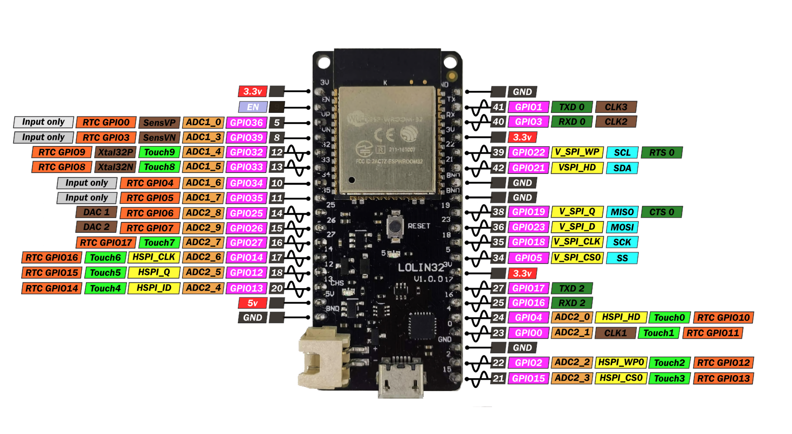

# GPIO

GPIO è l'acronimo di `General Purpose Input Output` ed è il concetto con cui si descrive l'interazione della MCU con tutto l'hardware che è
possibile collegare ad essa. Tipicamente, il collegamento avviene per mezzo dei `pin` che contornano la MCU. 

    Ma quale corrispondenza c'è fra i vari pin e il codice che possiamo scrivere con MicroPython??

La risposta è semplice ma un pò articolata. 

Prima di tutto il sistema di pin ha un ruolo e una numerazione, come vediamo nella figura sottostante

Con un pochino di esperienza capiremo al volo quali pin utilizzare e come... per adesso osserviamo le scritte **viola** del tipo `GPIOXX` dove `XX` 
è il numero identificativo del pin in questione: quello è il numero che ci serve per interagire con il dispositivo eventualmente collegato
a quel pin fisico.

Alcuni di essi hanno la scritta **rossa**: `3.3v` oppure `5v`. Indicano il voltaggio che si può ottenere collegando un dispositivo a uno di quei pin.
Ovviamente serve per alimentarlo :smile:

Altri hanno la scritta **nera**: `GND` (ground). Serve per il collegamento a terra di un circuito elettrico.

Infine alcuni hanno la scritta **grigia**: `Input Only`. Servono per il collegamento solo di input, ovvero per la lettura dei dati 
da un eventuale dispositivo alla MCU.

Gli altri colori... con calma. Con questi siamo già sufficientemente operativi.

Negli esempi di codice che seguono andremo a ragionare su un sensore, un attuatore, un... hardware da collegare in qualche modo alla nostra MCU, con
cui interfacciarsi osservando questa immagine di riferimento e utilizzando la libreria MicroPython necessaria.

Proviamo!!!

 
 
 

