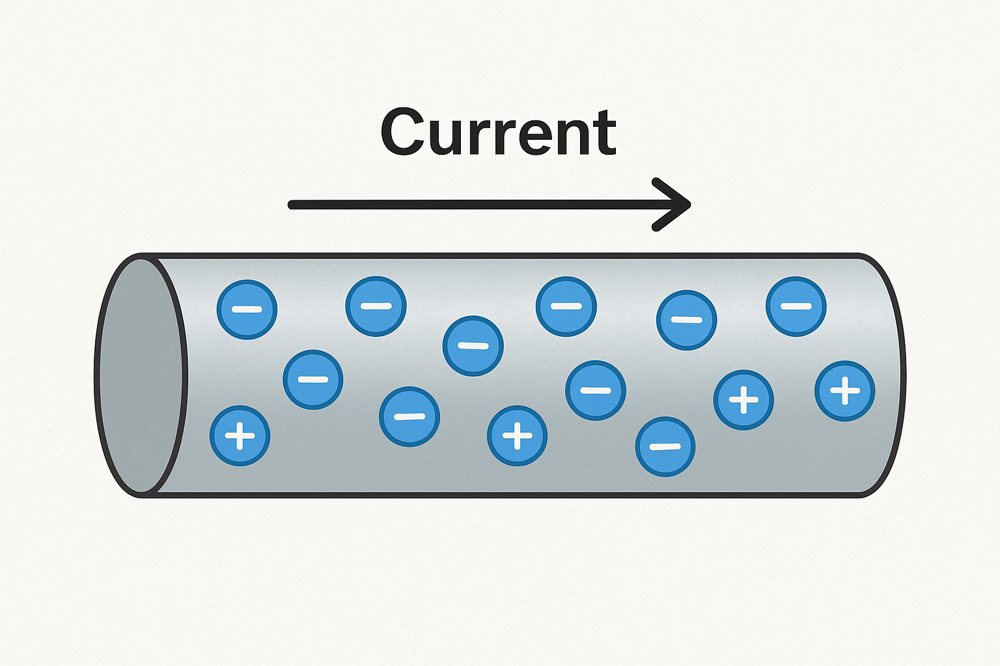

# Corrente, Tensione e Circuito Elettrico

Immagina l’elettricità come un “traffico” di minuscole particelle cariche, gli elettroni, che possono muoversi dentro certi materiali. Quando questo movimento è organizzato e continuo parliamo di **corrente elettrica**. In altri termini, la corrente elettrica è la quantità di carica (elettroni) che passa in un circuito nell’unità di tempo.  
L’unità di misura è l’**ampere (A)** e corrisponde a un **coulomb al secondo**.  
  ### Relazione tra corrente e carica

La corrente elettrica \( I \) è definita come la variazione della carica \( Q \) nel tempo:

$$
I = \frac{dQ}{dt}
$$
    

Per far muovere quelle cariche serve una spinta. Quella spinta si chiama **tensione** o **differenza di potenziale** ed è l’energia disponibile per ogni unità di carica affinché compia un percorso. Si misura in **volt (V)** e puoi pensarla come la **pressione** che mette in moto l’acqua. Se la tensione è alta, gli elettroni hanno più energia per attraversare un componente; se è bassa, la spinta è modesta. In termini fisici, **1 V = 1 J/C**: un volt è un joule di energia per coulomb di carica.  
 

Non è diverso dall’idea di una portata d’acqua in un tubo: più elettroni scorrono in un secondo, maggiore è la corrente.  

Analogia con il flusso di acqua in un tubo.  
, altri oppongono resistenza (isolanti o, più spesso, resistenze controllate). La relazione più celebre che lega questi elementi è la **legge di Ohm**: `V = I · R`. A parità di tensione, una resistenza grande lascia passare poca corrente; a parità di resistenza, più volt significano più ampere. Da qui discende anche la **potenza elettrica**, `P = V · I`: è il ritmo con cui l’energia viene trasformata, ad esempio in luce o calore.

Un **circuito elettrico** è il percorso chiuso che permette alla corrente di andare dal polo positivo a quello negativo di una sorgente e tornare indietro. “Chiuso” è la parola chiave: senza un anello completo, le cariche non possono fluire in modo continuo. La sorgente (una batteria, un alimentatore) stabilisce la differenza di potenziale; i conduttori offrono il cammino; i componenti lungo la strada — lampadine, resistenze, sensori, motori — trasformano l’energia elettrica in altre forme utili. Se apri l’anello con un interruttore, interrompi il flusso; se lo richiudi, la corrente riprende immediatamente a scorrere. In quest’ottica, un **corto circuito** è un percorso troppo facile e quasi senza resistenza tra i poli: la corrente diventa enorme e la potenza si scarica dove non dovrebbe, con rischi di surriscaldamento e danni.

Nella pratica quotidiana incontriamo due modi diversi di “erogare” la tensione. La **corrente continua (DC)**, tipica delle batterie e dei microcontrollori come l’ESP32, mantiene costanti polarità e valore, al netto di piccole ondulazioni. La **corrente alternata (AC)**, tipica della rete domestica, fa oscillare periodicamente la tensione e, di conseguenza, la direzione del flusso medio della corrente. È lo stesso concetto di spinta e flusso, ma con un profilo temporale diverso; i circuiti si progettano tenendo conto di quale forma di energia elettrica useranno.

Capire corrente e tensione come flusso e spinta, e il circuito come anello chiuso che permette all’energia di compiere un “lavoro”, rende naturale anche il modo in cui misuriamo e colleghiamo gli strumenti. L’**amperometro** si mette *in serie* perché deve “sentire” quanta carica passa lì dentro; il **voltmetro** si mette *in parallelo* perché confronta l’energia per carica tra due punti. E quando i componenti si collegano, valgono due regole intuitive: ciò che entra in un nodo deve uscire (conservazione della carica), e lungo un giro completo la somma delle salite e discese di tensione si bilancia (l’energia “guadagnata” dalla sorgente è “spesa” nei carichi).

In fondo, tutta l’elettronica — dai LED accesi in laboratorio fino ai computer — è un gioco di pressioni e flussi organizzati in percorsi chiusi. La tensione decide quanta energia è a disposizione, la corrente racconta quanto “traffico” c’è, la resistenza stabilisce quanto è agevole la strada, e il circuito è la mappa che fa funzionare tutto in armonia.
