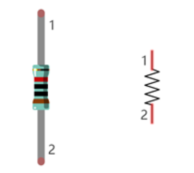

# Sensori e ESP32

In questo capitolo andremo semplicemente a definire gli oggetti di base tramite i quali costruire i nostri progetti hardware, 
governati da un ESP32 e controllati tramite codice MicroPython.

Introduciamoli:

## BreadBoard

Una BreadBoard è un componente fisico utilizzato per i circuiti di test e per la didattica. Ha una struttura molto semplice, comprensibile al volo
semplicemente osservando l'immagine seguente:

Nel dubbio, riassumo quanto bisognerebbe dedurre al volo:

- la breadboard è *spaccata* in due a metà: la parte sopra NON comunica con la parte sotto
- le *colonne* evidenziate in verde hanno ognuna tutti i fori collegati fra loro: tipicamente servono per i collegamenti elettrici
- le *righe* rosse e blu sono anch'esse ognuna tutte collegate fra loro: tipicamente servono per l'alimentazione dei circuiti

## Resistenze

Una resistenza è un componente elettrico passivo che si oppone al passaggio di corrente elettrica. Quanto forte sia la sua capacità di opposizione 
dipende dalla quantità di corrente che passa e dalla sua... *resistenza*. 

> La capacità di opposizione si misura in Ohm e il rapporto fra le grandezze in gioco è descritto dalla **Prima legge di Ohm**:
>
> `V = R * I`
>
> dove:
>
> - `V` rappresenta la differenza di potenziale fra le due estremità della resistenza e si misura in `Volt (V)`
> - `R` rappresenta la resistenza del componente elettrico al passaggio di corrente e si misura in `Ohm (Ω)`
> - `I` rappresenta la quantità di corrente in attraversamento e si misura in `Ampere (A)`

!!! tip "I colori delle resistenze"

    Come avrete notato, le resistenze hanno dei cerchi colorati che le decorano, che servono a capire
    con quale resistenza abbiamo a che fare.
    
    Per capire come funzionano... provare a ragionare sull'immagine seguente:
    
    
    

 
 
 

