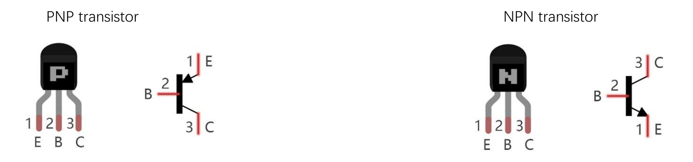

# Sensori e ESP32

In questo capitolo andremo semplicemente a definire gli oggetti di base tramite i quali costruire i nostri progetti hardware, 
governati da un ESP32 e controllati tramite codice MicroPython.

Introduciamoli!

## BreadBoard

Una **breadboard** è una basetta di prototipazione per realizzare esperimenti e prototipi senza il bisogno di eseguire saldature: permette di collegare componenti elettronici e fili inserendoli *a pressione* nella basetta per montare, testare e modificare circuiti in pochi secondi. È perfetta per attività didattiche, perché gli studenti possono sperimentare senza rischiare di rovinare i componenti. E senza rischiare di bruciarsi le dita usando il saldatore a stagno necessario per saldare i *fili*. Nella foto seguente si vede una classica basetta *breadboard* con una resistenza e un led inseriti nella basetta.

---

## Come è fatta e come funziona  
La figura seguente ci aiuta a capire come è fatta una breadboard. Questa parte del documento lo dovete **ASSOLUTAMENTE CAPIRE BENE** per evitare di bruciare 🔥 il vostro circuito
 (e quindi anche i componenti che vi fornisce la scuola 🤬). 
    
- **Blocchi centrali (matrice):** quelli con le linee verdi. Ci sono due sezioni di fori separate da una fessura. Come indicato dall'immagine i fori segnati con la linea verde sono collegati fra di loro. 
> ATTENZIONE: i fori della parte superiore non sono collegati con i fori della parte inferiore anche se appartengono alla stessa colonna.

- **Binari di alimentazione (rail):** due coppie di linee laterali contrassegnate (+ rosso, – blu/nero) che corrono **in orizzontale** lungo la breadboard. Queste linee sono utilizzate per mettere le alimentazioni (ad. esempio 5V o 3.3V) e il segnale di massa o ground (anche indicato come GND). Capirete qualcosa in più quando daremo concetti elementari di circuiti elettrici. Per evitare problemi usate la convenzione di mettere le alimentazioni sulle linee rosse e il ground sulla linea nera/blu.
>ATTENZIONE: tutti i fori indicati in rosso sono collegati tra loro, così come tutti i fori indicato in blu. Ma la parte superiore non è collegata con la parte inferiore.
La stessa figura vi fa vedere (nella parte a destra) come effettivamente sono eseguiti i collegamenti tramite contatti metallici che, come ovviamente sapete, sono materiali conduttivi.  

## Resistenze

Una resistenza è un componente elettrico passivo che si oppone al passaggio di corrente elettrica. Quanto forte sia la sua capacità di opposizione 
dipende dalla quantità di corrente che passa e dalla sua... *resistenza*. 

> La capacità di opposizione si misura in Ohm e il rapporto fra le grandezze in gioco è descritto dalla **Prima legge di Ohm**:
>
> `V = R * I`
>
> dove:
>
> - `V` rappresenta la differenza di potenziale fra le due estremità della resistenza e si misura in `Volt (V)`
> - `R` rappresenta la resistenza del componente elettrico al passaggio di corrente e si misura in `Ohm (Ω)`
> - `I` rappresenta la quantità di corrente in attraversamento e si misura in `Ampere (A)`

!!! tip "I colori delle resistenze"

    Come avrete notato, le resistenze hanno dei cerchi colorati che le decorano, che servono a capire
    con quale resistenza abbiamo a che fare.
    
    Per capire come funzionano... provare a ragionare sull'immagine seguente:
    
    
    

## Transistor

Un transistor è un dispositivo elettronico in grado di funzionare da interruttore o da amplificatore. 
Come si intuisce dalle figure sotto, un transistor è un oggetto elettronico con tre collegamenti verso l’esterno:

1. **Base** (B): da dove solitamente arrivano i segnali di comando
2. **Emettitore** (E): da dove solitamente escono i segnali elaborati dal transistor
3. **Collettore** (C): da dove solitamente arriva la corrente

Neanche a dirlo, nel nostro kit sono disponibili ben due tipologie di transistor:

- **transistor NPN, o transistor negativo**
- **transistor PNP, o transistor positivo**

La differenza fondamentale fra i due tipi sta nel fatto che nel transistor NPN la corrente positiva va collegata al collettore C, ottenendo in uscita una corrente negativa, mentre nel transistor PNP la corrente positiva va collegata all’emettitore E, ottenendo in uscita una corrente positiva.

Quando serviranno in alcuni dei progetti che faremo... ci ritorneremo!

 
 
 

