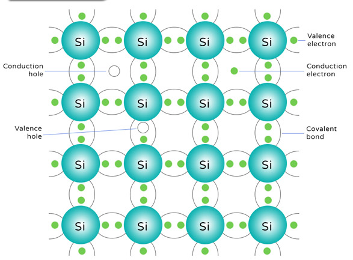
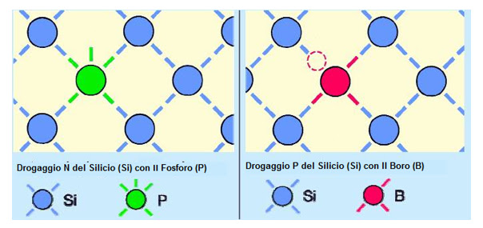
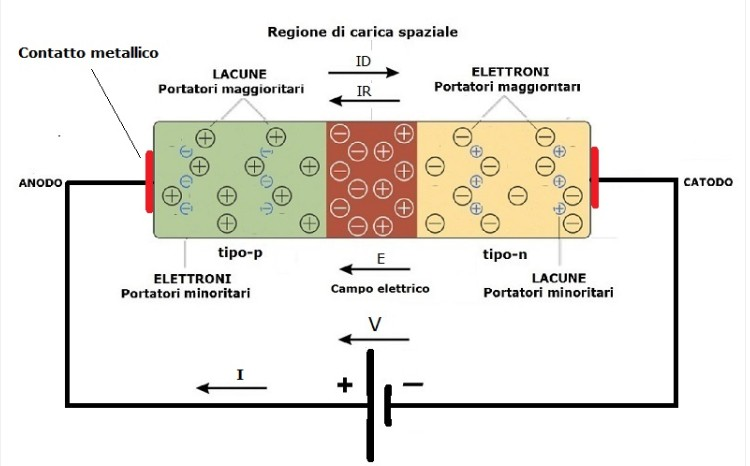

# Lezione sul LED  
## Funzionamento teorico e applicazioni pratiche con ESP32 e MicroPython

---

## Introduzione
In questa lezione verrà studiato il **LED (Light Emitting Diode)**, uno dei componenti elettronici più semplici ma anche più utilizzati.  
La lezione è divisa in due parti:
1. **Parte teorica**: funzionamento fisico ed elettrico del LED  
2. **Parte pratica**: utilizzo del LED con ESP32 e programmazione in MicroPython  

---

## 1. Parte teorica 

### 1.1 I Semiconduttori  
I semiconduttori, nella scienza e tecnologia dei materiali, sono materiali che hanno resistività intermedia tra i metalli e gli isolanti. In condizioni ambiente, sono esempi di semiconduttori il silicio e il germanio elementari, l'arseniuro di gallio (GaAs) e il carburo di silicio (SiC).

Essi sono alla base di tutti i principali dispositivi elettronici e microelettronici a stato solido quali transistor, diodi e diodi a emissione luminosa (LED).  
  

## Il semiconduttore e la sua conducibilità

Un **semiconduttore** è un materiale la cui **conducibilità elettrica** è intermedia tra quella di un conduttore (come il rame) e quella di un isolante (come la plastica).  
La sua conducibilità dipende dalla **struttura energetica degli elettroni** all’interno del materiale.

---

## Bande energetiche: valenza e conduzione

Negli atomi di un solido, gli elettroni possono occupare solo determinati **livelli energetici**, organizzati in **bande**:

- **Banda di valenza**  
  È la banda energetica occupata dagli elettroni legati agli atomi, responabili dei legami chimici e che normalmente non si muovono.  
  In questa banda gli elettroni **non possono muoversi liberamente**, quindi non contribuiscono alla corrente elettrica.
  

- **Banda di conduzione**  
  È una banda energetica superiore, pià alta rispetto a quella di conduzione dove gli elettroni:  
  - non sono più legato ad un atomo specifico;
  - possono muoversi liberamente nel materiale;
  - quindi trasportano corrente elettrica.  
    
  In pratica, gli elettroni che raggiungono questa banda sono **liberi di muoversi** nel materiale e possono quindi **condurre corrente**.

Tra le due bande esiste una zona proibita detta **gap energetico** (*band gap*).  
- se il gap è piccolo -> l'elettrone può saltare facilmente nella banda di conduzione;  
- se il gap è grande -> è molto difficile realizzare il salto.  

---

## Confronto tra materiali, metalli, semiconduttori, isolanti  
LA loro classificazione dipende tutto da come sono queste bande:  

- **Conduttori o Metalli**  
  La banda di valenza e quella di conduzione si sovrappongono → gli elettroni sono liberi di muoversi.

- **Isolanti**  
  Il gap energetico è molto grande → gli elettroni non riescono a raggiungere la banda di conduzione. Non c'è passaggio di corrente. 

- **Semiconduttori**  
  Il gap energetico è **piccolo ma non nullo** → alcuni elettroni possono passare alla banda di conduzione se ricevono energia (calore, luce, campo elettrico).


---

## Il caso del silicio

Il **silicio (Si)** è il semiconduttore più utilizzato in elettronica.

Caratteristiche principali:
- ha **4 elettroni di valenza**
- forma una struttura cristallina molto stabile
- a temperatura ambiente ha pochi elettroni liberi



Nel silicio puro:
- la **banda di valenza** è quasi completamente occupata
- la **banda di conduzione** è quasi vuota

A temperatura ambiente, una piccola quantità di elettroni:
- riesce a superare il gap energetico
- passa nella banda di conduzione
- lascia una **lacuna** nella banda di valenza

---

## Elettroni e lacune
Quando un elettrone passa alla banda di conduzione:
- l’elettrone libero contribuisce alla corrente
- la **lacuna** si comporta come una carica positiva mobile

Nel semiconduttore la corrente è quindi dovuta a:
- **elettroni** nella banda di conduzione
- **lacune** nella banda di valenza

---

## Perché il silicio è così importante
Il silicio è ideale perché:

- può essere facilmente **drogato** per controllarne la conducibilità
- è abbondante e stabile in natura

Queste proprietà rendono il silicio (opportunamente drogato) la base per la realizzazione di dispositivi largamente utilizzati in elettronica come:
- diodi
- LED
- transistor
- microprocessori
 
## Il drogaggio  
Il drogaggio consiste nell’aggiungere piccolissime quantità di atomi “estranei” al silicio puro per modificare la sua conducibilità elettrica. Importante capire che con il drogaggio non si cambia il materiale ma il comportamento elettrico del silicio.  
Vediamo alcuni concetti base. Il silicio puro ha:  
- ha 4 elettroni di valenza  
- forma 4 legami covalenti  
- conduce pochissimo (quasi isolante)  
  
Quindi per far muovere gli elettroni, serve aiutarlo. Per far questo, il silicio viene **drogato***

### 1.1 Drogaggio di tipo N e di tipo P

#### Drogaggio di tipo N  
Nel reticolo cristallino del silicio, si aggiungono atomi con 5 elettroni di valenza (gruppo V):
- Fosforo (P)
- Arsenico (As)

In questo modo succede che:  
- 4 elettroni fanno i legami
- 1 elettrone resta libero

L'elettrone che rimane libero può muoversi facilmente e movimento di elettroni significa corrente elettrica.

Questo tipo di silicio si dice drogato N in quanto nella struttura cristallina risulta presente una eccedenza di cariche negative (N) che si possono facilmente muovere. E quindi il silicio, che in condizioni non drogate è un elemento *semi-conduttore*, in oppurtune condizioni che vedremo di seguito, può diventare conduttore.

#### Drogaggio di tipo P

Si aggiungono atomi con 3 elettroni di valenza (gruppo III): 
- Boro (B)  
- Alluminio (Al)

Con questo tipo di drogaggio, ci sono tre elettroni che il Boro, ad esempio mette a disposizione per i collegamenti di valenza con gli atomi di silicio. Di conseguenza, manca un elettrone per completare i legami del reticolo cristallino.

Si, in pratica, una lacuna (buco). Le lacune si comportano come cariche positive. 
Questo tipo di silicio si dice drogato P in quanto nella struttura cristallina risulta presente una eccedenza di cariche positive (P) in cui gli elettroni possono facilmente occupare. 
Anche in questo caso, il silicio, che in condizioni non drogate è un elemento *semi-conduttore*, in oppurtune condizioni che vedremo di seguito, può diventare conduttore.

### 1.2 La giunzione PN  
Una **giunzione a semiconduttore**, detta anche **giunzione PN**, è l’unione di due materiali semiconduttori drogati in modo diverso:

- **Regione P**: contiene un eccesso di **lacune** (cariche positive)
- **Regione N**: contiene un eccesso di **elettroni** (cariche negative)


Quando le due regioni vengono messe a contatto, una parte delle lacune in eccesso presenti nello strato p inizieranno a migrare verso lo strato n. Viceversa, una parte degli elettroni in eccesso nello strato n inizieranno a migrare verso lo strato p. In realtà, il moto delle lacune è solo apparente: essendo esse niente altro che "assenza di elettroni" non sono vere cariche positive che si spostano. Tuttavia, per convenzione, vengono considerate come particelle fittizie cariche positivamente che si spostano al pari degli elettroni.  

Quindi: 
- elettroni e lacune tendono a ricombinarsi
- si crea una **zona di svuotamento** (depletion zone)
- nasce una **barriera di potenziale**, si raggiunge un equilibrio che impedisce il passaggio  di corrente  
  

### Polarizzazione della giunzione a circuito chiuso  
Ora analizzeremo il comportamento della giunzione p-n a circuito chiuso, ossia il funzionamento della giunzione p-n a cui viene applicato un campo elettrico esterno, quindi collegheremo gli estremi della giunzione ad una batteria.
- **Polarizzazione diretta**:  
  Applicando una tensione che riduce la barriera di potenziale, la corrente può fluire attraverso la giunzione. Inizieremo l’analisi del funzionamento della giunzione p-n a circuito chiuso collegando la batteria in modo da polarizzare direttamente la giunzione. Quindi, collegheremo il polo positivo della batteria al contatto metallico dell’anodo della zona p e il polo negativo al contatto metallico del catodo della zona n come indicato in figura.     
    

  Quando si applica una tensione sufficiente (almeno maggiore di 0,7V) alla giunzione PN, l'effetto è quello di vincere la condizione di equilibrio raggiunta con il contatto, nuovi elettroni vengono forniti al silicio di tipo N, i quali riescono a superare la barriera di equilibrio per procedere nella sezione P. Si crea quindi un flusso di corrente.  

- **Polarizzazione inversa**:  
  Nella polarizzazione inversa, applicando una tensione opposta, la barriera aumenta e la corrente non passa.  

### Perché è importante  
La giunzione PN può funzionare come un interruttore: 
- applicando ai suoi capi una tensione opportuna, la corrente circola e il circuito è chiuso;  
- togliendo questa tensione, la giunzione PN funziona come un interruttore aperto, quindi la corrente non circola.  
- 
La giunzione PN è alla base del funzionamento di molti dispositivi elettronici:
- diodi
- LED
- transistor
- circuiti integrati

### 1.3 Il LED
Nel LED, la corrente che attraversa la giunzione produce **luce** grazie alla ricombinazione di elettroni e lacune.  

### 1.1 Cos’è un LED
Il LED (Light Emitting Diode) è un **diodo a emissione luminosa**, cioè un componente elettronico semiconduttore che:
- lascia passare la corrente in **un solo verso**
- emette **luce** quando viene attraversato da corrente elettrica

### 1.2 Perchè emette luce    

Un LED (Light Emitting Diode) è una giunzione PN che, quando è polarizzata direttamente, emette luce.

Il principio di funzionamento è sempre lo stesso del diodo (giunzione PN): riduzione della barriera di potenziale e passaggio di corrente.

**La differenza sta in come viene rilasciata l’energia.**  

Quando il LED è polarizzato direttamente:  
- gli elettroni del lato N attraversano la giunzione
- le lacune del lato P attraversano la giunzione
- avviene la ricombinazione elettrone–lacuna  

e fin qui il comportamento è quello di un diodo normale.  

Durante la ricombinazione l’elettrone passa da un livello energetico più alto (banda di conduzione) a uno più basso (banda di valenza).  
La differenza di energia non viene dissipata come calore ma viene emessa sotto forma di fotone (luce).

**Questa emissione si chiama elettroluminescenza.**


Il **colore della luce** emessa dipende dal materiale semiconduttore e dal suo **gap energetico**.

---
### 1.3 Polarizzazione del LED
Il LED ha due terminali:
- **Anodo (+)** → gamba più lunga
- **Catodo (−)** → gamba più corta

Per funzionare correttamente:
- l’anodo deve essere collegato al positivo
- il catodo al negativo (GND)

Se collegato al contrario:
- il LED non conduce
- il LED non si accende

---

### 1.4 Tensione diretta e corrente
Il LED **non è una resistenza** e **non deve essere collegato direttamente a una sorgente di tensione**.

Valori tipici:
- **Tensione diretta (Vf)**:
  - Rosso: ~1.8–2.0 V
  - Verde: ~2.0–2.2 V
  - Blu / Bianco: ~3.0–3.3 V
- **Corrente nominale**:
  - 5–20 mA

Senza limitazione di corrente il LED **si danneggia**.

---

### 1.5 Resistenza di limitazione
Per proteggere il LED si utilizza una **resistenza in serie**.

Formula di calcolo: R = (V_alimentazione − V_LED) / I_LED


Esempio:
- ESP32: 3.3 V
- LED rosso: 2.0 V
- Corrente: 10 mA

R = (3.3 − 2.0) / 0.01 = 130 Ω


Valori commerciali consigliati:
- 150 Ω
- 220 Ω

---


## 2. Parte pratica – LED con ESP32 e MicroPython

### 2.1 Obiettivi della parte pratica
- Collegare correttamente un LED a un ESP32
- Usare un GPIO come uscita digitale
- Controllare il LED tramite software
- Comprendere il legame tra codice e hardware

---

### 2.2 Materiale necessario
- ESP32
- LED
- Resistenza da 220 Ω
- Breadboard
- Cavetti jumper
- PC con MicroPython installato sull’ESP32

---

### 2.3 Collegamento hardware
Schema logico di collegamento:

metto una figura


Esempio pratico:
- GPIO utilizzato: GPIO 2
- Collegamento a GND per il catodo

---

### 2.4 Primo programma: LED lampeggiante

```python
from machine import Pin
import time

led = Pin(2, Pin.OUT)

while True:
    led.value(1)   # Accende il LED
    time.sleep(1)
    led.value(0)   # Spegne il LED
    time.sleep(1)
```
### 2.5 Altre esercitazioni  

Creare un circuito con 3 led (di colore Rosso, Gialla e Verde).  
I led devono essere comandati dal vostro programma in modo indipendente, quindi dovrete collegare ogni circuito del led con 3 diversi GPIO.

Quindi realizzate 3 programmi diversi che:  
- accende e spegne tutti i led in contemporanea;  
- accende un led alla volta in progressione (1 acceso e gli altri spenti) 
- simulare il comportamento di un semaforo stradale.  
  
### 2.6 Codice MORSE  

Realizzare un programma in micropython e ESP32 per **trasmettere un messaggio in codice Morse**.

Materiale:  
- ESP32  
- 1 LED  
- 1 resistenza (220 ohm)  
- breadboard e cavetti  

Il programma deve:

- Definire una stringa di testo (solo lettere e spazi, es. "SOS AIUTO"). La strnga deve essere chiesta in input.  
- Convertire ogni lettera nel codice Morse corrispondente.
- Trasmettere il messaggio usando il LED secondo le regole:
- Punto (·) → LED acceso per 0,2 s
- Linea (–) → LED acceso per 0,6 s
- Pausa tra simboli → 0,2 s
- Pausa tra lettere → 0,6 s
- Pausa tra parole → 1,4 s
- Ripetere il messaggio in ciclo continuo.

Usa un dizionario Python per associare ogni lettera al suo codice Morse.  

## 2.7 Binario  
Realizzare un programma che inserito in input un numero rappresenti il numero in binario. Si consideri un numero compreso tra 0 e 15. 

Si usino 4 led (bit3, bit2, bit1, bit0) che si accendo in corrispondenza di un 1 e si spengono in corrispondenza di uno 0. 
Ad esempio: 10 --> 1010 (ON-OFF-ON-OFF)  

Se il numero è maggiore di 15 o minore di 0, i 4 led lampeggiano contemporaneamente per 4 secondi. 

