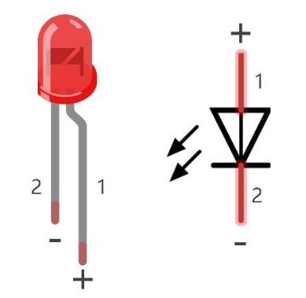

# Led(s)


Introduciamo i componenti fondamentali con cui andremo a lavorare:

## LED

Un LED è un componente elettronico che funziona solo quando la corrente scorre nel verso giusto. 
Tipicamente ha due poli: **il polo positivo nel pin più lungo** (catodo) e **il polo negativo nel pin più corto** (anodo). 



I led lavorano ad una corrente di attraversamento compresa fra 1.9V e 3.3V. Se la corrente supera questo voltaggio, il LED si danneggerà e magari...
prenderà fuoco. :wink:


<!-- ################################################################################# -->
### LED Integrato


Come abbiamo (probabilmente) già anticipato, la nostra MCU (il microcontrollore, l'ESP32) contiene un led integrato in essa e collegato
direttamente al Pin fisico numero 5.

Per farlo funzionare sarà necessario semplicemente eseguire un codice del genere:


``` py title="Led integrato lampeggiante"
import machine
import time

# Il pin 5 è quello del LED programmabile
# Ricordate?
led = machine.Pin(5, Pin.OUT)
led.off()

while True:
    led.on()
    print("LED Acceso")
    time.sleep(1)
    
    led.off()
    print("LED Spento")
    time.sleep(1)
```


Non c'è molto altro da aggiungere :smile:


<!-- ################################################################################# -->
### LED Fisico


In questo progetto dobbiamo costruire un circuito per collegare un led all'ESP32. Il circuito dovrà realizzare uno schema tipo il seguente:


A seconda del PIN scelto per il collegamento fisico del LED, modificate il codice dell'esempio precedente per far accendere il led che avete appena collegato.


<!-- ################################################################################# -->
## LED Bar


La barra dei LED è un semplice componente in cui sono integrati ben 8 LED (o addirittura 10!!)! 
Il collegamento fisico al microcontrollore è una semplice iterazione del circuito del LED:


Adesso tramite codice andiamo a fornire un comportamento al nostro progetto: Facciamo in modo che ogni secondo la barra si riempa
sempre più e poi inizi a svuotarsi. Ecco il codice:

``` py title="ledbar che si carica e scarica"
import machine
import time

# Gli 8 pin, in ordine come connessi alla ledbar
pins=[a,b,c,d,e,f,g,h,i]

acceso = True
while True:
    for p in pins:
        led = machine.Pin( p, Pin.OUT)
        led.value( acceso )
        time.sleep_ms(500)
    
    # rovescia l'ordine dei pin
    pins.reverse()
    
    # inverti vero/falso
    acceso = not acceso
```


<!-- ################################################################################# -->
## Esercizi

!!!tip "Dal vivo o con il simulatore!"

    Ognuno dei seguenti esercizi può essere svolto indifferentemente dal vivo, ovvero con ESP32 e sensori reali,
    oppure con il simulatore wokwi (ad esempio come compiti per casa)!!!
  
  

<br>

**Luci della Polizia!**

Due led, uno rosso e uno blu. Si accendono alternativamente ogni decimo di secondo (regolate il tempo necessario, se un decimo è poco o troppo!)
Quando la luce rossa si accende, la blu si spegne e viceversa

<br>

**Semaforo**

Tre led: verde, giallo, rosso. Implementazione di un semaforo. All'inizio la luce gialla lampeggia (accesa.. spenta.. accesa.. spenta). Poi tutto un tratto (scegliete voi quanto) parte il semaforo! Prima la luce rossa per due secondi, poi la luce verde per 4 secondi, la luce gialla per 1 secondo. Poi rosso e si ricomincia!


<br>

**LED...Bar**

Una ledbar collegata all'esp32. La barra inizia da spenta e poi inizia il *caricamento* accendendo prima un led, poi due, poi tre... e così via ogni secondo.
Quando la barra è piena rimane accesa per due secondi, poi si spegne completamente per un secondo, poi si riaccende completamente per due secondi.
A questo punto inizia a *scaricarsi*. Ogni secondo si spegne un led fino a che la barra non sia completamente spenta.<br>
A questo punto il programma termina.


<br>
<br>
<br>

