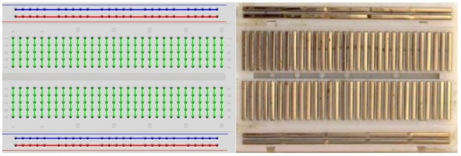
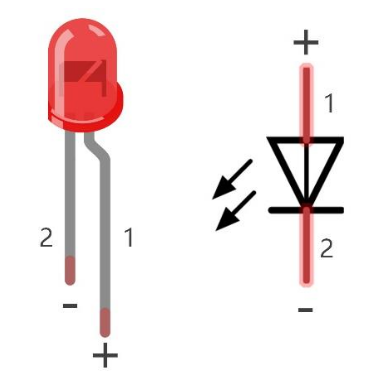
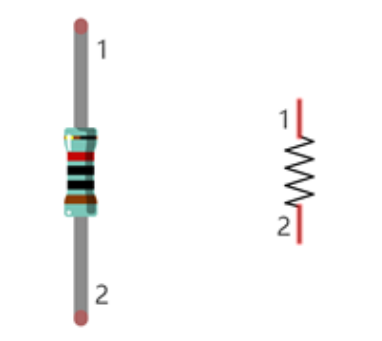
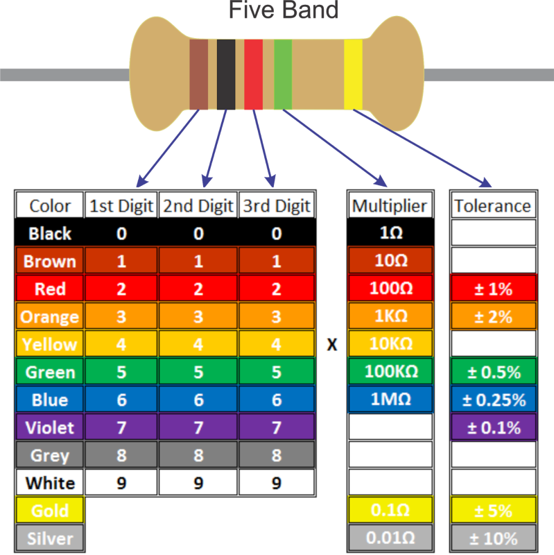
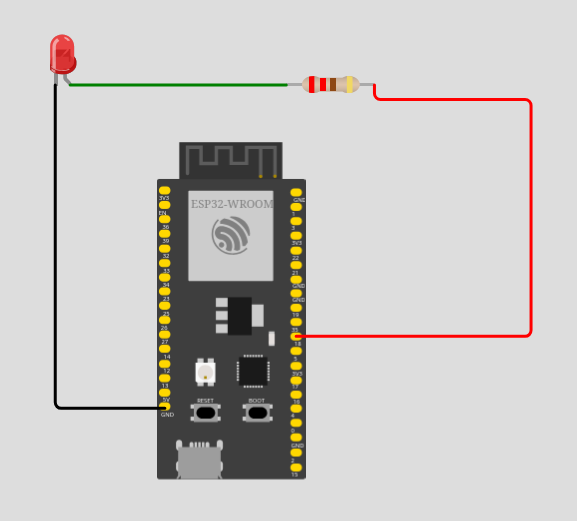
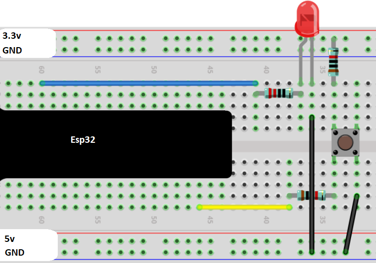
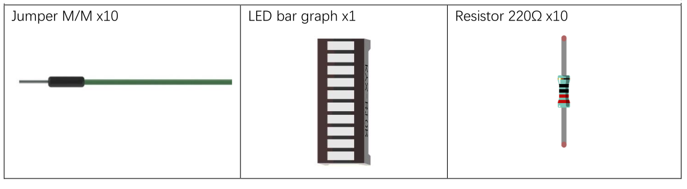
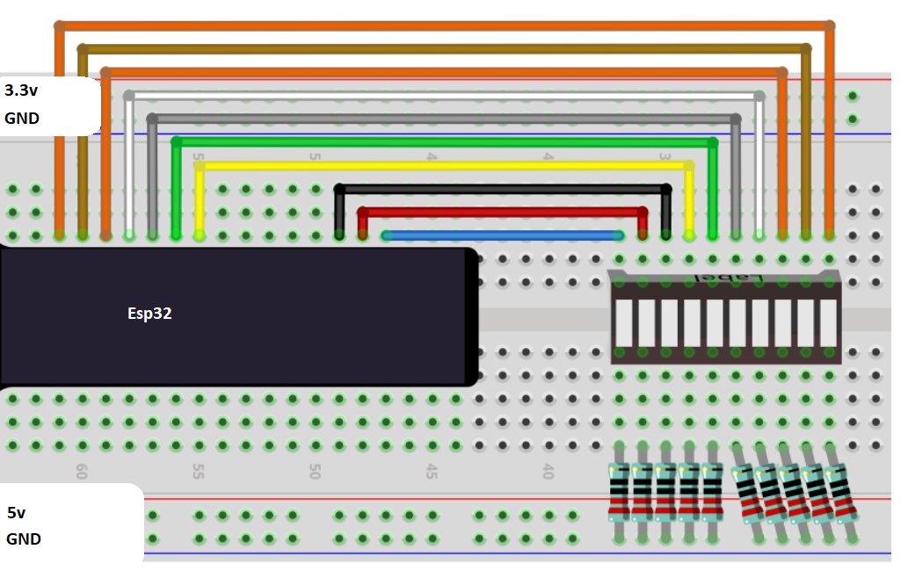

# Sensori e ESP32


In questo capitolo andremo a provare alcuni esperimenti in cui costruiremo progetti hardware basati
sui LED, governati da un ESP32 e controllati tramite codice MicroPython.

Introduciamo i componenti fondamentali con cui andremo a lavorare:

## Componenti coinvolti


### BreadBoard

Una BreadBoard è un componente fisico utilizzato per i circuiti di test e per la didattica. Ha una struttura molto semplice, comprensibile al volo
semplicemente osservando l'immagine seguente:



Nel dubbio, riassumo quanto bisognerebbe dedurre al volo:

- la breadboard è *spaccata* in due a metà: la parte sopra NON comunica con la parte sotto
- le *colonne* evidenziate in verde hanno ognuna tutti i fori collegati fra loro: tipicamente servono per i collegamenti elettrici
- le *righe* rosse e blu sono anch'esse ognuna tutte collegate fra loro: tipicamente servono per l'alimentazione dei circuiti


### LED

Un LED è un componente elettronico che funziona solo quando la corrente scorre nel verso giusto. Tipicamente ha due poli: il polo positivo (catodo)
nel pin più lungo e il polo negativo (anodo) nel pin più corto. 



I led lavorano ad una corrente di attraversamento compresa fra 1.9V e 3.3V. Se la corrente supera questo voltaggio, il LED si danneggerà e magari...
prenderà fuoco.


### Resistenze

Una resistenza è un componente elettrico passivo che si oppone al passaggio di corrente elettrica. Quanto forte sia la sua capacità di opposizione 
dipende dalla quantità di corrente che passa e dalla sua... *resistenza*. 





> La capacità di opposizione si misura in Ohm e il rapporto fra le grandezze in gioco è descritto dalla **Prima legge di Ohm**:
>
> `V = R * I`
>
> dove:
>
> - `V` rappresenta la differenza di potenziale fra le due estremità della resistenza e si misura in `Volt (V)`
> - `R` rappresenta la resistenza del componente elettrico al passaggio di corrente e si misura in `Ohm (Ω)`
> - `I` rappresenta la quantità di corrente in attraversamento e si misura in `Ampere (A)`


!!! tip "I colori delle resistenze"

    Come avrete notato, le resistenze hanno dei cerchi colorati che le decorano, che servono a capire
    con quale resistenza abbiamo a che fare.
    
    Per capire come funzionano... provare a ragionare sull'immagine seguente:
    
    
    
    
<!-- ################################################################################# -->
## LED

Questo progetto è identico a quello del LED integrato nella MCU che lampeggia. La differenza (sostanziale)
sta nel fatto che in questo progetto il LED è esterno e collegato ad un PIN a piacere (fra quelli... ammissibili).

Vediamo la lista dei componenti necessari (oltre ovviamente all'ESP32 e alla breadboard su cui è alloggiato):


Vediamo adesso come costruire il circuito del LED:





A seconda del PIN scelto per il collegamento fisico del LED, dobbiamo indicare il numero nel codice (io ci ho lasciato il 5 del led integrato):

``` python
from machine import Pin
from time import sleep

# Il pin 5 è quello del LED programmabile
# Ricordate?
led = Pin(5, Pin.OUT)

# come promesso...
print("Hello, World!")

while True:
    if led.value():
        led.value(False)
        print("LED Spento")
    else:
        led.value(True)
        print("LED Acceso")
    
    # Aspetta 1 secondo...
    sleep(1)
```


<!-- ################################################################################# -->
## Buttons

Nel secondo progetto abbiamo un pulsante collegato ad un LED nel nostro circuito. Incredibilmente... 
quando si clicca il pulsante dovrebbe accendersi la luce!!!

Vediamo la lista dei componenti:


E adesso vediamo lo schema elettrico del progetto:





Quello che manca è il codice di funzionamento. Eccolo:

``` python
from machine import Pin

# Ovviamente, vanno scelti accuratamente i valori del pin GPIO
led = Pin(xxx, Pin.OUT)
button = Pin(yyy, Pin.IN,Pin.PULL_UP) 

while True:
    if not button.value():     
        led.value(0)
    else:
        led.value(1)
```


<!-- ################################################################################# -->
## LED Bar


La barra dei LED è un semplice componente in cui sono integrati ben 8 LED! Per il nostro progetto avremo bisogno di:





Fatto questo, andate a collegare i componenti come in figura:





Adesso tramite codice andiamo a fornire un comportamento al nostro progetto: Facciamo in modo che ogni secondo la barra si riempa
sempre più e poi inizi a svuotarsi. Ecco il codice:

``` python
import time
from machine import Pin

# Gli 8 pin, in ordine come connessi alla ledbar
pins=[a,b,c,d,e,f,g,h,i]

acceso = True
while True:
    for p in pins:
        led = Pin( p, Pin.OUT)
        led.value( acceso )
        time.sleep_ms(500)
    
    # rovescia l'ordine dei pin
    pins.reverse()
    
    # inverti vero/falso
    acceso = not acceso
```


<!-- ################################################################################# -->
## Esercizi

<br>

**Luci della Polizia!**

Implementare un circuito con due luci, una rossa e una blu, che si accendono alternativamente.

<br>

**Semaforo**

Implementare un circuito con tre luci: verde, giallo, rossa a rappresentare un semaforo. Tramite codice, con un opportuno timer,
programmare la giusta alternanza di luci tipica di un semaforo.

<br>


**Note Musicali**

Con la barra dei led ed una opportuna struttura dati, implementare una sequenza di note facendo corrispondere al primo led un DO, al secondo un RE...
Qualsiasi melodia da flauto dolce va bene!!!


<br>


**Button LED...Bar**

Pulsante e barra dei led.

Primo livello: quando si clicca il pulsante, parte il caricamento della barra, che poi si scaricherà quando è tutta piena.

Secondo livello: implementare il primo livello tramite la chiamata ad una funzione (tipo `caricaLedBar`).

Terzo livello: Quando si clicca di nuovo il pulsante il caricamento si interrompe.


<br>
<br>
<br>

