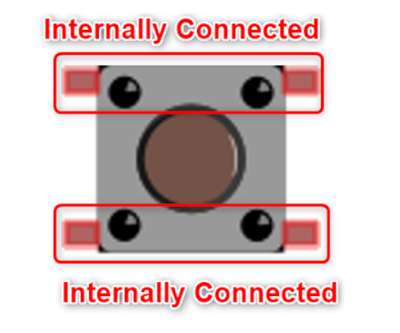
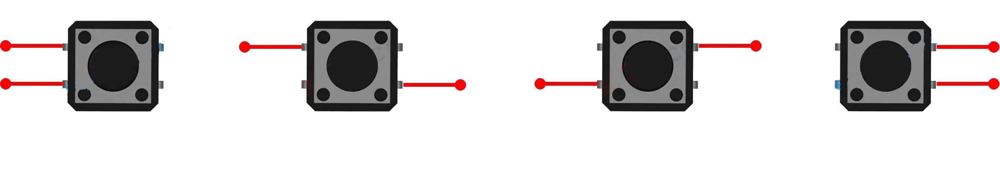

# Buttons


In questo capitolo andremo a provare alcuni esperimenti in cui costruiremo
progetti hardware basati sui pulsanti e i led, governati da un ESP32 e
controllati tramite codice MicroPython.

I pulsanti hardware hanno due caratteristiche fisiche che vanno sempre considerate quando se ne inserisce uno in un circuito:

- **floating inputs**: significa che quei segnali non hanno un valore ben definito (0 o 1) ma sono variabili (floating). In questo modo l'ESP32 non sa se il valore di tensione che legge sui suoi pin sia 1 (3.3V) oppure 0 (0V). Questo problema si può risolvere con una resistenza di `pull-up` o di `pull-down`. Vedremo meglio con il circuito elettrico.

- **Dobouncing**: quando si preme il pulsante, l'interruttore interno rimbalza più volte prima di assestarsi. Di conseguenza l'ESP32 legge valori 0 e 1 che cambiano continuamente e il programma che esegue istruzioni in base agli input potrebbe funzionare male. Questo problema si può risolvere con tecniche di `debouncing`. ( in seguito viene mostrata l'implementazione SW del debouncing)

Vediamo come è fatto internamente un pulsante:



E vediamo in quali modi è possibile collegarlo al nostro ESP32:



In qualunque dei 4 modi indicati sopra, tutto il circuito passerà sempre per il pulsante, che avrà la possibilità di *aprirlo* o *chiuderlo*.

Capito che servono due collegamenti, ci sono due modi il cui il pulsante può essere collegato al circuito:

1. in modalità `pull-down`, con una estremità connessa al `GPIO`, l'altra alla tensione di `3.3V`: in questo caso, quando il pulsante è premuto il valore è `HIGH`, altrimenti è `LOW`.
2. in modalità `pull-up`, con una estremità connessa al `GPIO`, l'altra al `GND`: in questo caso, quando il pulsante è premuto il valore è `LOW`, altrimenti è `HIGH`.


<!-- ##################################################################### -->
## Gestione debouncing

Quando si preme un pulsante fisico, il circuito si apre e si chiude decine o centinaia di volte. Questo fenomeno è chiamato *bouncing*.
Ciò accade a causa della natura meccanica dei pulsanti: quando i contatti metallici si uniscono, c'è un breve periodo in cui il contatto non è perfetto,
il che causa una serie di rapide transizioni di apertura/chiusura.


    Ovviamente, il pulsante del simulatore non ha problemi di contatti *fisici*, ma è in grado di *simularli* impostando la variabile `Bounce` del pulsante:

    - Se la imposti a `True`, il simulatore creerà un centinaio di segnali aperto/chiuso ad ogni pressione del pulsante
    - Se la imposti a `False`, il simulatore creerà una singola coppia di segniali aperto/chiuso per ogni pressione.


Il seguente codice presenta una semplice tecnica di *debouncing software*. Permette di tenere traccia delle pressioni utente di un pulsante.


``` py title="debouncing software"
# Se sei nel simulatore, imposta a OFF il Debounce del pulsante
from machine import Pin

# immaginiamo di gestire un pulsante collegato al pin 19 e al GND
# impostato in modalità PULL_UP
button = Pin(19, Pin.IN,Pin.PULL_UP)

buttonValue = button.value()
print("valore iniziale del pulsante: ", buttonValue)


while True:
    actualValue = button.value()
    if buttonValue == actualValue:
        continue

    if actualValue == False:
        print("hai cliccato il pulsante...")

    buttonValue = actualValue
```


<!-- ##################################################################### -->
## Esempi con i pulsanti


In questo progetto di prova abbiamo un pulsante collegato ad un LED nel nostro circuito. Incredibilmente...
quando si clicca il pulsante dovrebbe accendersi la luce!!!

Per ottenere questo effetto vogliamo collegare il pulsante in modalità PULL_DOWN e reagire quando questo viene premuto.
Vediamo lo schema elettrico del progetto:


Quello che manca è il codice di funzionamento. Eccolo:

``` python
from machine import Pin


led = Pin(16, Pin.OUT)
button = Pin(25, Pin.IN,Pin.PULL_UP)

while True:
    if button.value():
        led.on()
    else:
        led.off()
```


<!-- ################################################################################# -->
## Esercizi


**Button LED...Bar**

Progetto contenente un pulsante e una barra dei led. Quando si clicca il pulsante, parte il caricamento della barra,
che poi si scaricherà quando è tutta piena.

Difficoltà ulteriore: quando si clicca di nuovo il pulsante il caricamento si interrompe.


<br>


<br>
<br>
<br>
