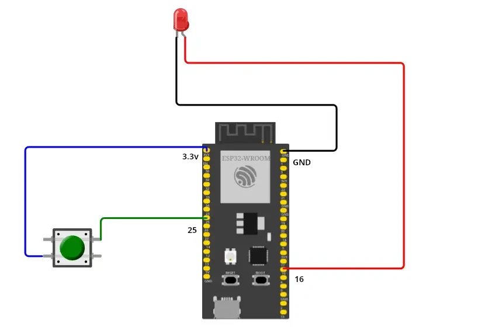

# Buttons


In questo capitolo andremo a provare alcuni esperimenti in cui costruiremo
progetti hardware basati sui pulsanti e i led, governati da un ESP32 e
controllati tramite codice MicroPython.

I pulsanti hardware hanno due caratteristiche fisiche che vanno sempre considerate quando se ne inserisce uno in un circuito:

- **floating inputs**: significa che quei segnali non hanno un valore ben definito (0 o 1) ma sono variabili (floating). In questo modo l'ESP32 non sa se il valore di tensione che legge sui suoi pin sia 1 (3.3V) oppure 0 (0V). Questo problema si può risolvere con una resistenza di `pull-up` o di `pull-down`. Vedremo meglio con il circuito elettrico.

- **Debouncing**: quando si preme il pulsante, l'interruttore interno rimbalza più volte prima di assestarsi. Di conseguenza l'ESP32 legge valori 0 e 1 che cambiano continuamente e il programma che esegue istruzioni in base agli input potrebbe funzionare male. Questo problema si può risolvere con tecniche di `debouncing`. ( in seguito viene mostrata l'implementazione SW del debouncing)

Vediamo come è fatto internamente un pulsante:


Di seguito è indicato uno schema di collegamento di un pulsante:  

   

NOTA:  
- Resistenza R2 serve per evitare che il segnali di input sia *floating* ma messo a un valore di riferimento di 1 (3.3V) - **pull up**  
- La resistenza R3 non è indispensabile ma caldamento consigliata per proteggere il pin di ingresso GPIO da eventuali sovratensioni. E quindi dalla sua rottura.   
- Si può evitare di mettere il pullup esterno inserendone uno all'interno dell'ESP32 con il seguente comando:  *Pin(14, Pin.IN, **Pin.PULL_UP**)*  


## Gestione debouncing  

Quando si preme un pulsante fisico, il circuito si apre e si chiude decine o centinaia di volte. Questo fenomeno è chiamato *bouncing*.
Ciò accade a causa della natura meccanica dei pulsanti: quando i contatti metallici si uniscono, c'è un breve periodo in cui il contatto non è perfetto,
il che causa una serie di rapide transizioni di apertura/chiusura.


> NOTA PER il SIMULATORE  
Ovviamente, il pulsante del simulatore non ha problemi di contatti *fisici*, ma è in grado di *simularli* impostando la variabile `Bounce` del pulsante:  
    - Se la imposti a `True`, il simulatore creerà un centinaio di segnali aperto/chiuso ad ogni pressione del pulsante  
    - Se la imposti a `False`, il simulatore creerà una singola coppia di segniali aperto/chiuso per ogni pressione.


Di seguito viene mostrato una funzione che esegue il debouncing. In pratica quando si sente che il pulsante è stato premuto (0), si aspetta altro tempo in modo da far passare il periodo dei rimbalzi(ad esempio 50msec) e si controlla se c'è ancora 0.

``` py 
import time

def debounce(pin, delay_ms=50):
    """
    Ritorna True solo se il pulsante è premuto
    e il debounce è passato.
    """
    if pin.value() == 0:  # pulsante premuto (pull-up)
        time.sleep_ms(delay_ms)
        if pin.value() == 0:
            return True
    return False

```
Di seguito, viene mostrato come usare la funzione **debouncing**.  

``` py title="debouncing software"
from machine import Pin

button = Pin(14, Pin.IN, Pin.PULL_UP)

while True:
    if debounce(button): # se ritorna True, allora fai qualcosa
        print("Pulsante premuto")
        time.sleep_ms(300)  # evita ripetizioni

```


<!-- ##################################################################### -->
## Esempi con i pulsanti


In questo progetto di prova abbiamo un pulsante collegato ad un LED nel nostro circuito. Incredibilmente...
quando si clicca il pulsante dovrebbe accendersi la luce!!!


Per ottenere questo effetto vogliamo collegare il pulsante in modalità PULL_DOWN e reagire quando questo viene premuto.
Vediamo lo schema elettrico del progetto (ricordate che nel simulatore si può evitare di mettere il pullup):





Quello che manca è il codice di funzionamento. Eccolo:

``` python
from machine import Pin


led = Pin(16, Pin.OUT)
button = Pin(25, Pin.IN,Pin.PULL_UP)

while True:
    if button.value():
        led.on()
    else:
        led.off()
```


<!-- ################################################################################# -->
## Esercizi


**Button LED_Bar**

Progetto contenente un pulsante e una barra dei led. Quando si clicca il pulsante, parte il caricamento della barra,
che poi si scaricherà quando è tutta piena.

Difficoltà ulteriore: quando si clicca di nuovo il pulsante il caricamento si interrompe.  

**Lampeggio controllato**  
Progetto in cui se si tiene premuto un secondo, il led lampeggio 5 volte, se si tiene premuto 3 secondi, il led lampeggia 10 volte.


<br>


<br>
<br>
<br>
