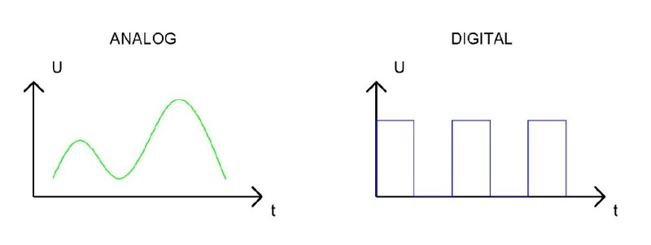
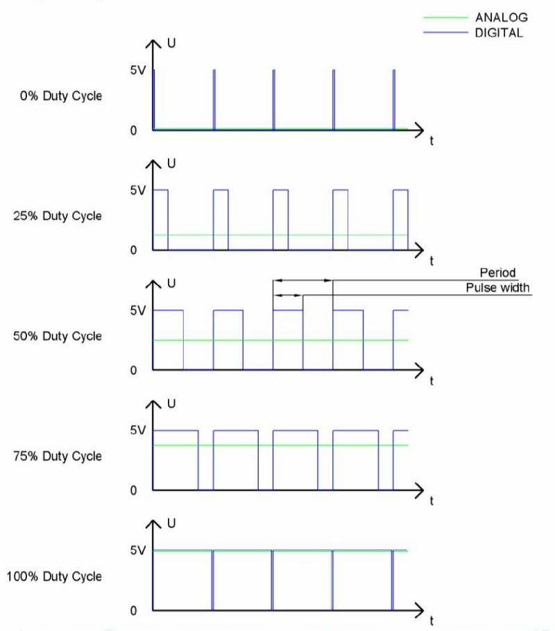

# Analog && PWM


In questa sezione cercheremo di capire la (semplice) differenza fra segnali digitali e analogici e come essi possano essere realizzati 
e gestiti nelle nostre composizioni.

Un segnale analogico è un segnale continuo nel tempo e nella variazione di valore, mentre un segnale digitale è un segnale discreto 
nel tempo e nella variazione di valore.

La figura spiega molto chiaramente il concetto espresso:





In informatica ed elettronica si utilizzano molto spesso i segnali digitali binari identificati con 0 e 1, mentre ovviamente i segnali 
analogici hanno un range ben definito (ad esempio, fra 0 e A, per qualche A positivo e neanche troppo grande).<br>
Ovviamente esiste praticamente sempre un sistema di conversione dei segnali da digitale ad analogico e viceversa.


## Pulse Width Modulation

PWM è una tecnologia che permette di utilizzare segnali digitali per controllare circuiti analogici. L’idea è quella di alternare 
per un certo periodo i segnali digitali 0 e 1, calcolando la percentuale di tempo in cui il segnale sta a 1: quell’informazione è detta duty cycle.

È chiaro che PWM non è una reale trasformazione di un segnale da digitale ad analogico, ma che calcolando l’energia trasportata 
nel periodo di pulsazione si riesce ad approssimare con efficacia la quantità analogica da rappresentare.

<br>



<br>

Esistono dispositivi hardware (a costi accessibili) in grado di implementare un grado di accuratezza fino a 10 bit, 
che significa distinguere fino a 1024 valori analogici diversi.

L’implementazione di PWM dell'ESP32 ha 8 canali separati, ognuno dei quali può gestire la frequenza in maniera indipendente, cioè ognuno dei Pin di output PWM sono configurabili a frequenze diverse.

Per comprenderne il funzionamento, facciamo un esempio con il led programmabile (GPIO 5):

``` py
import machine
import time

# il led da gestire 
ledPin = machine.Pin(5)

# tempo di attesa in millisecondi 
# varia questo numero per aumentare/diminuire la velocità di illuminazione del led
ms_time = 100

# l'oggetto per la gestione del PWM
# richiede:
# - l'oggetto fisico su cui applicare il PWM (nel nostro caso, il led)
# - la frequenza in ms del pwm
pwm = machine.PWM( ledPin, 10000)

while True:
    
    # qui si carica...
    for i in range(0,1023):
        pwm.duty(i)
        time.sleep_ms(ms_time)
    
    # ...qui si scarica.
    for i in range(0,1023):
        pwm.duty(1023 - i)
        time.sleep_ms(ms_time)

# ripulisce l'oggetto del PWM
pwm.deinit()
```


<!-- ################################################################################# -->
## Breathing LED

Con "Breathing LED" si intende un LED che cambia la sua intensità luminosa in maniera continua e controllata.
Il materiale necessario per il progetto è elencato nella figura sottostante


Il circuito da realizzare consiste nel collegamento del LED alla resistenza esattamente come nei precedenti esempi sui LED.


<!-- ################################################################################# -->
## RGB LED


Un led RGB non è altro che un led in grado di generare 3 differenti colori. Attivando i tre colori insieme e mescolandoli 
opportunamente con tecniche PWM è possibile sostanzialmente ottenere qualsiasi colore.


!!! note "SINTESI ADDITIVA (RGB)"

    La sintesi delle luci: se punti una luce rossa nello stesso punto di una luce verde, vedi una luce colore giallo!

        I colori fondamentali di questa sintesi sono Rosso (Red), Verde (Green), Blu (Blue).

        La somma dei 3 colori fondamentali fa il BIANCO!!!

    Ogni colore fondamentale "costa" un byte, quindi ogni colore "pesa" 3 byte, ovvero sono rappresentabili 2 alla 24 colori diversi: 
    circa 16 milioni di colori!<br>
    Il web utilizza questa sintesi dei colori.<br>
    La sua rappresentazione è data dai 3 byte, tipicamente indicati con la sintassi esadecimale `#RRGGBB`<br>
    Questa sintassi indica che i primi 2 numeri esadecimali rappresentano il byte che indica la quantità di rosso presente, 
    i secondi la quantità di verde, gli ultimi la quantità di blu.

    ``` 
        Ad esempio:
        #FF0000 rappresenta il rosso
        #00FF00 rappresenta il verde
        #0000FF rappresenta il blu
        #000000 è il nero
        #FFFFFF è il bianco
        #888888 è un grigio
        #ADADAD è un grigio più chiaro
        #FF8888 è un rosso chiaro
        ...
    ```


Nel nostro progetto andiamo a comporre un circuito con i seguenti componenti:


Organizziamo il circuito in questo modo:


<!-- ################################################################################# -->
## Esercizi

<br>

**Semaforo**

Implementare un semaforo con un unico LED RGB: ogni 3 secondi la luce passa in maniera continua  da verde a giallo, 
poi dopo altri 3 secondi da giallo a rosso e dopo altri 3 secondi da rosso a verde.

E poi si ricomincia.

Modificare il progetto in modo da poter decidere liberamente la durata delle luci verde, gialla, rossa.

<br>

**Luci Alternate**

Implementare un progetto con 2 luci LED semplici. Le luci si alternano in senso continuo, in modo che la somma dei 2 duty cycle sia sempre 100.<br>
Modificare il codice per fare in modo che ogni luce sia completamente accesa (e l’altra completamente spenta) per 3 secondi.

<br>

**LED e Pulsante**

Implementare un progetto con un pulsante e un LED. Il led è inizialmente spento. Quando si clicca il pulsante, il led inizia ad accendersi 
fino ad essere completamente acceso, poi inizia a spegnersi e continua ad alternare le due fasi in maniera continua.

Quando si clicca di nuovo il pulsante, l’avanzamento si interrompe e la luce rimane ferma. Quando si clicca di nuovo la luce riparte dal punto 
in cui si era precedentemente fermata.

<br>

**Caricamento barra dei LED**

Implementare un progetto con una barra dei led. Ogni led si accende dopo un secondo e quando la barra è piena dopo un secondo 
ricomincia a spegnersi.


<br>
<br>
<br>

