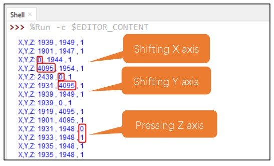

# Joystick con ESP32

## Componenti e collegamenti

Un joystick è un dispositivo di input utilizzato per controllare la 
posizione di un cursore o di un oggetto su uno schermo, 
soprattutto nei contesti di videogiochi, simulatori di volo o altre applicazioni interattive. Si tratta di una leva o di un dispositivo simile che può essere spostato in diverse direzioni per controllare il movimento di un cursore o di un'entità virtuale.

I joystick possono avere varie forme e dimensioni, 
ma in genere consistono in una leva che può essere inclinata o spostata 
in diverse direzioni.

Esso fornisce al processore i segnali elettrici relativi alla posizione
di due, l'asse X e l'asse Y. 
Inoltre il joystick ha a disposizione anche l'asse Z 
che ci servirà per indicare la pressione o meno del joystick stesso.


In figura vediamo  i collegamenti elettrici che 
il nostro joystick richiede. 
Nel nostro caso, invece della tensione di 5V come indicato in figura, 
useremo una tensione di 3.3 volt (vedremo in seguito dove prelevare questa tensione).
Quando spostiamo il joystick lungo gli assi X e Y, si va ad alterare il valore di due 
resistenze con l'effetto di variare i valori di tensione che arriveranno a due pin del dispositivo ESP32.
La lettura dei questi valori di tensione, opportunamente trasformati in numeri (da 0 a 4095), ci 
serviranno per capire la posizione del joystick (da un estremo all'altro).


I due segnali VRX e VRY sono due segnali analogici che andranno 
collegati direttamenti a due pin GPIO del componente ESP32 con 
funzione di convertitore Analogico-Digitale.

La lista dei componenti necessari è indicata nella figura seguente:


I componenti andranno collegati secondo lo schema della figura sotto. 
Fare attenzione che nel pin del joystick in cui è indicato il valore di 5V, in realtà 
bisogna mettere il valore di 3.3V 
che potete trovare nel pin in alto a sinistra del componente ESP32.


## Codice

I segnali elettrici collegati ai pin 13 e 14 vengono trasformati in segnali digitali (numeri)
In pratica il valore di tensione in ingresso andrà da un valore di 0V a un valore di 3.3V a seconda della posizione del 
joystick. I corrispondenti valori digitali saranno 0 (per 0V) e 4095 (per 3.3V).

Al pin 12 arriverà in input o un valore basso (0 o LOW) o valore alto (1 o HIGH) 
a seconda se il pin verrà premuto o meno.

Il codice è sotto riportato.

```python
from machine import ADC,Pin
import time

xVal=ADC(Pin(14)) #ADC sta per Analog-Conversion Converter
yVal=ADC(Pin(13))
zVal=Pin(12,Pin.IN,Pin.PULL_UP) #

xVal.atten(ADC.ATTN_11DB)
yVal.atten(ADC.ATTN_11DB)
xVal.width(ADC.WIDTH_12BIT)
yVal.width(ADC.WIDTH_12BIT)

while True:
  print("X,Y,Z:",xVal.read(),",",yVal.read(),",",zVal.value())
  time.sleep(1)

```

Quello che dovreste vedere sarà qualcosa del genere:


