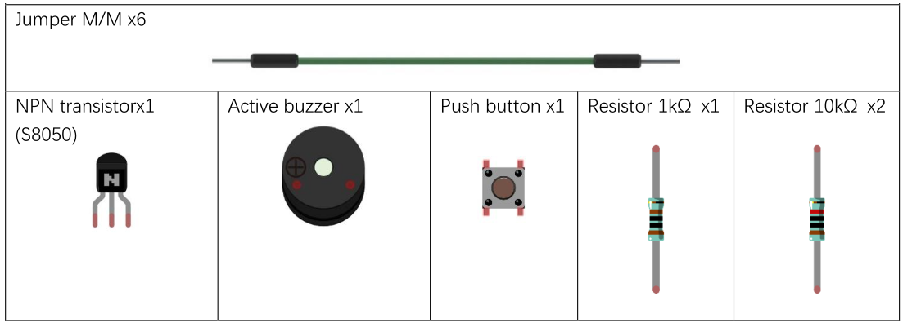

# Sensori: i buzzers


I buzzer sono dei componenti sonori utilizzati nei più disparati dispositivi elettrici ed elettronici: nei calcolatori, negli orologi, 
negli allarmi, nei cruscotti delle auto, nei campanelli delle case fino ai... cellulari!

I tipi di buzzer che noi utilizzeremo sono molto semplici (e non troppo rumorosi) ma concettualmente identici a tutti gli altri, 
diversi magari per dimensione e/o rumorosità.

I buzzer sono di due tipi:

1. **buzzer attivi**: sono quelli che hanno un oscillatore al loro interno e che per suonare necessitano solo di essere alimentati
2. **buzzer passivi**: necessitano di un oscillatore esterno (nel nostro caso un PWM) per emettere un suono.


I buzzer attivi sono semplicissimi da usare, ma tipicamente sono in grado di fare solo uno specifico suono. I buzzer passivi necessitano di un intero circuito per funzionare, ma di contro possono essere regolati per emettere suoni a frequenze differenti.

Se tutto fosse così facile... staremmo già cominciando a divertirci con i progetti di oggi...ma purtroppo c’è un altro problema da risolvere: 
i buzzer per fnuzionare necessitano di una quantità di corrente decisamente superiore a quella erogata dai nostri dispositivi!

Per risolvere questa ulteriore problematica, dobbiamo utilizzare un **transistor**.


Un transistor è un dispositivo elettronico in grado di funzionare da interruttore o da amplificatore. 
Come si intuisce dalle figure, un transistor è un oggetto elettronico con tre collegamenti verso l’esterno:

1. **Base** (B): da dove solitamente arrivano i segnali di comando
2. **Emettitore** (E): da dove solitamente escono i segnali elaborati dal transistor
3. **Collettore** (C): da dove solitamente arriva la corrente

Neanche a dirlo, nel nostro kit sono disponibili ben due tipologie di transistor:

- **transistor NPN, o transistor negativo**
- **transistor PNP, o transistor positivo**

La differenza fondamentale fra i due tipi sta nel fatto che nel transistor NPN la corrente positiva va collegata al collettore C, 
ottenendo in uscita una corrente negativa, mentre nel transistor PNP la corrente positiva va collegata all’emettitore E, 
ottenendo in uscita una corrente positiva.

Vabbè... speriamo di capire meglio le cose lavorando ai progetti...

<!-- ################################################################################# -->
## Buzzer: campanello

Il campanello è un progetto concettualmente semplice: quando tieni cliccato un pulsante, il campanello suona, quando lo lasci smette.

Poiché non abbiamo bisogno di variare toni e intensità del suono utilizzeremo un buzzer attivo, collegato ad un transistor NPN! 
Ecco l’elenco dei componenti:





Per quanto riguarda il circuito da implementare, ecco una immagine che lo descrive:


Selezionati i pin a cui collegare il buzzer e il pulsante, ecco il codice per l'implementazione del campanello:


```python
from machine import Pin

button = Pin(xxx,Pin.IN,Pin.PULL_UP)
activeBuzzer = Pin(yyy,Pin.OUT)

activeBuzzer.value(0)

while True:
    if not button.value():
        activeBuzzer.value(1)
    else:
        activeBuzzer.value(0)
```


<!-- ################################################################################# -->
## Buzzer: allarme

Un allarme funziona in maniera analoga al progetto del campanello, ma ha il tipico suono ondulato che varia dall’acuto al grave in maniera continua. 
Per ottenere ciò, **dovremo sostituire il buzzer attivo con uno passivo e implementare un PWM**.


Il progetto è uguale al precedente, quello che cambia è semplicemente il tipo di buzzer, il fatto che il pin di collegamento dovrà
per forsa supportare il PWN e il codice:


```python
from machine import Pin,PWM
import math
import time

PI = 3.14

button = Pin(xxx,Pin.IN,Pin.PULL_UP)

pinB = Pin(yyy,Pin.OUT)
passiveBuzzer = PWM( pinB, 2000)

def alert():

        
while True:
    if not button.value():
        passiveBuzzer.init()
        
        for x in range(0,36):
            sinVal = math.sin(x*10*PI/180)
            toneVal = 2000 + int(sinVal*500)
            passiveBuzzer.freq(toneVal)
            time.sleep_ms(10)   
    else:
        passiveBuzzer.deinit()

passiveBuzzer.deinit()
```


<!-- ################################################################################# -->
## Esercizi


**Sirena**

Implementare un progetto con un buzzer che suona per 2 secondi ogni 3 secondi.

---

**Luce e Suono**

Aggiungete una luce a LED al progetto precedente. Quando il buzzer suona, la luce deve accendersi.

---


**Barra dei led e suono**

Implementare un progetto con un buzzer passivo e una barra dei led. Quando il buzzer suona la barra dei led si accende. 
Più è acuto il suono, più la barra deve "caricarsi". La barra va spenta completamente solo quando il suono è spento.


<br>
<br>
<br>

