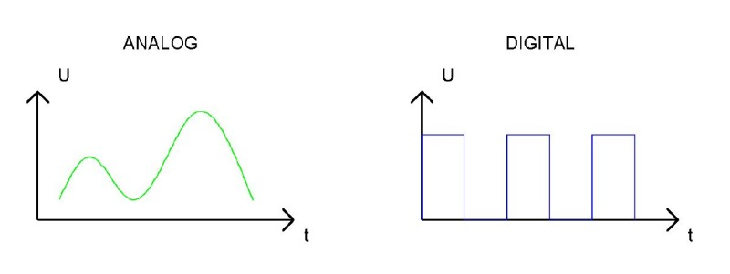
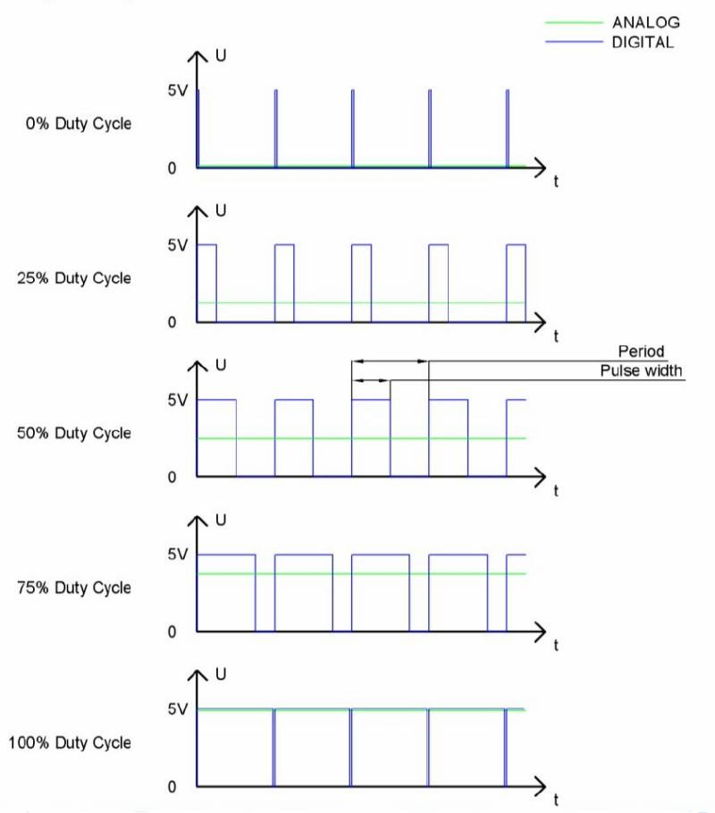

# Analog && PWM


In questa sezione cercheremo di capire la (semplice) differenza fra segnali digitali e analogici e come essi possano essere realizzati
e gestiti nelle nostre composizioni.

Un segnale analogico è un segnale continuo nel tempo e nella variazione di valore, mentre un segnale digitale è un segnale discreto
nel tempo e nella variazione di valore.

La figura spiega molto chiaramente il concetto espresso:





In informatica ed elettronica si utilizzano molto spesso i segnali digitali binari identificati con 0 e 1, mentre ovviamente i segnali
analogici hanno un range ben definito (ad esempio, fra 0 e A, per qualche A positivo e neanche troppo grande).<br>
Ovviamente esiste praticamente sempre un sistema di conversione dei segnali da digitale ad analogico e viceversa.


## Pulse Width Modulation

PWM è una tecnologia che permette di utilizzare segnali digitali per controllare circuiti analogici. L’idea è quella di alternare
per un certo periodo i segnali digitali 0 e 1, calcolando la percentuale di tempo in cui il segnale sta a 1: quell’informazione è detta duty cycle.

È chiaro che PWM non è una reale trasformazione di un segnale da digitale ad analogico, ma che calcolando l’energia trasportata
nel periodo di pulsazione si riesce ad approssimare con efficacia la quantità analogica da rappresentare.

<br>



<br>

Esistono dispositivi hardware (a costi accessibili) in grado di implementare un grado di accuratezza fino a 10 bit,
che significa distinguere fino a 1024 valori analogici diversi.

L’implementazione di PWM dell'ESP32 ha 8 canali separati, ognuno dei quali può gestire la frequenza in maniera indipendente, cioè ognuno dei Pin di output PWM sono configurabili a frequenze diverse.

Per comprenderne il funzionamento, facciamo un esempio con il led programmabile (GPIO 5):

``` py
from machine import Pin,PWM
import time

# il led da gestire
ledPin = Pin(5, Pin.OUT)

# tempo di attesa in millisecondi
# varia questo numero per aumentare/diminuire la velocità di illuminazione del led
ms_time = 100

# l'oggetto per la gestione del PWM
# richiede:
# - l'oggetto fisico su cui applicare il PWM (nel nostro caso, il led)
# - la frequenza in ms del pwm
pwm = PWM( ledPin, 10000)

while True:

    # qui si carica...
    for i in range(0,1023):
        pwm.duty(i)
        time.sleep_ms(ms_time)

    # ...qui si scarica.
    for i in range(0,1023):
        pwm.duty(1023 - i)
        time.sleep_ms(ms_time)

# ripulisce l'oggetto del PWM
pwm.deinit()
```

<!-- ################################################################################# -->
## Breathing LED

Con "Breathing LED" si intende un LED che cambia la sua intensità luminosa in maniera continua e controllata.
Il materiale necessario e schema circuitale sono gli stessi di qualunque progetto con un LED! In questo caso però
bisogna essere sicuri che il pin di collegamento del LED supporti il PWM (cioè che abbia la caratteristica "ondina" nello schema del GPIO).

Il codice di gestione comprende il concetto di PWM così come la gestione del LED

``` py
from machine import Pin,PWM
import time

# un pin che supporti output e PWM
pin = Pin(18, Pin.OUT)

pwm = PWM( pin,10000)

# provate a modificare questo valore per osservare il cambio di comportamento
sleep_time = 1

while True:
    for i in range(0,1023):
        pwm.duty(i)
        time.sleep_ms( sleep_time )

    for i in range(0,1023):
        pwm.duty(1023-i)
        time.sleep_ms( sleep_time )

pwm.deinit()
```


<br>
<br>
<br>
