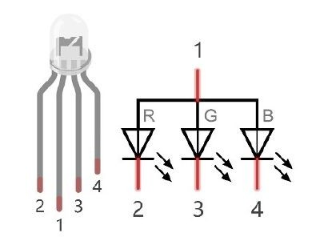

# RGB Led


Un led RGB non è altro che un led in grado di generare 3 differenti colori. Attivando i tre colori insieme e mescolandoli 
opportunamente con tecniche PWM è possibile sostanzialmente ottenere qualsiasi colore.





!!! note "SINTESI ADDITIVA (RGB)"

    La sintesi delle luci: se punti una luce rossa nello stesso punto di una luce verde, vedi una luce colore giallo!

        I colori fondamentali di questa sintesi sono Rosso (Red), Verde (Green), Blu (Blue).

        La somma dei 3 colori fondamentali fa il BIANCO!!!

    Ogni colore fondamentale "costa" un byte, quindi ogni colore "pesa" 3 byte, ovvero sono rappresentabili 2 alla 24 colori diversi: 
    circa 16 milioni di colori!<br>
    Il web utilizza questa sintesi dei colori.<br>
    La sua rappresentazione è data dai 3 byte, tipicamente indicati con la sintassi esadecimale `#RRGGBB`<br>
    Questa sintassi indica che i primi 2 numeri esadecimali rappresentano il byte che indica la quantità di rosso presente, 
    i secondi la quantità di verde, gli ultimi la quantità di blu.

    ``` 
        Ad esempio:
        #FF0000 rappresenta il rosso
        #00FF00 rappresenta il verde
        #0000FF rappresenta il blu
        #000000 è il nero
        #FFFFFF è il bianco
        #888888 è un grigio
        #ADADAD è un grigio più chiaro
        #FF8888 è un rosso chiaro
        ...
    ```
    
    


<!-- ################################################################################# -->
## Progetto: LED colorato

Nel nostro progetto andiamo a comporre un circuito con i seguenti componenti:


Organizziamo il circuito in questo modo:


Infine testiamo il seguente codice:


``` py
import machine
import random
import time

pinR = machine.Pin(xxx, machine.Pin.OUT)
pinG = machine.Pin(yyy, machine.Pin.OUT)
pinB = machine.Pin(zzz, machine.Pin.OUT)
pwmR = machine.PWM(pinR,10000)
pwmG = machine.PWM(pinG,10000)
pwmB = machine.PWM(pinB,10000)

while True:
    rPerc = random.randint(0,1023)
    gPerc = random.randint(0,1023)
    bPerc = random.randint(0,1023)
    pwmR.duty(rPerc)
    pwmG.duty(gPerc)
    pwmB.duty(bPerc)
    time.sleep_ms(200)

pwmR.deinit()
pwmG.deinit()
pwmB.deinit()
```


<!-- ################################################################################# -->
## Esercizi

<br>

**Semaforo**

Implementare un semaforo con un unico LED RGB: ogni 3 secondi la luce passa in maniera continua  da verde a giallo, 
poi dopo altri 3 secondi da giallo a rosso e dopo altri 3 secondi da rosso a verde.

E poi si ricomincia.

Modificare il progetto in modo da poter decidere liberamente la durata delle luci verde, gialla, rossa.

<br>

**Luci Alternate**

Implementare un progetto con 2 luci LED semplici. Le luci si alternano in senso continuo, in modo che la somma dei 2 duty cycle sia sempre 100.<br>
Modificare il codice per fare in modo che ogni luce sia completamente accesa (e l’altra completamente spenta) per 3 secondi.

<br>

**LED e Pulsante**

Implementare un progetto con un pulsante e un LED. Il led è inizialmente spento. Quando si clicca il pulsante, il led inizia ad accendersi 
fino ad essere completamente acceso, poi inizia a spegnersi e continua ad alternare le due fasi in maniera continua.

Quando si clicca di nuovo il pulsante, l’avanzamento si interrompe e la luce rimane ferma. Quando si clicca di nuovo la luce riparte dal punto 
in cui si era precedentemente fermata.

<br>

**Caricamento barra dei LED**

Implementare un progetto con una barra dei led. Ogni led si accende dopo un secondo e quando la barra è piena dopo un secondo 
ricomincia a spegnersi.


<br>
<br>
<br>

