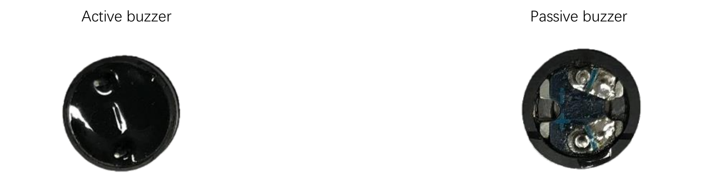

# Sensori: i buzzers


I buzzer sono dei componenti sonori utilizzati nei più disparati dispositivi elettrici ed elettronici: nei calcolatori, negli orologi, 
negli allarmi, nei cruscotti delle auto, nei campanelli delle case fino ai... cellulari!

I tipi di buzzer che noi utilizzeremo sono molto semplici (e non troppo rumorosi) ma concettualmente identici a tutti gli altri, 
diversi magari per dimensione e/o rumorosità.

I buzzer sono di due tipi:

1. **buzzer attivi**: sono quelli che hanno un oscillatore al loro interno e che per suonare necessitano solo di essere alimentati
2. **buzzer passivi**: necessitano di un oscillatore esterno (nel nostro caso un PWM) per emettere un suono.





I buzzer attivi sono semplicissimi da usare, ma tipicamente sono in grado di fare solo uno specifico suono. I buzzer passivi necessitano di un intero circuito per funzionare, ma di contro possono essere regolati per emettere suoni a frequenze differenti.

Tipicamente il collegamento all'ESP32 di un buzzer è il seguente:


<!-- ################################################################################# -->
## Buzzer attivo

Un buzzer attivo va semplicemente collegato come in figura e fatto suonare secondo il seguente
codice:


```python
from machine import Pin
import time

buzzer = Pin(33,Pin.OUT)

buzzer.off()

while True:
    buzzer.on()
    time.sleep(1)
    buzzer.off()
    time.sleep(1)
```


<!-- ################################################################################# -->
## Buzzer passivo

Il collegamento elettrico del buzzer passivo è concettualmente identico a quello attivo, ma va scelto un Pin di
collegamento che supporti il PWM, che va gestito a livello di codice.

```python
from machine import Pin,PWM
import math
import time

PI = 3.14

pinB = Pin(33,Pin.OUT)
passiveBuzzer = PWM( pinB, 2000)

        
passiveBuzzer.init()

for x in range(0,36):
    sinVal = math.sin(x*10*PI/180)
    toneVal = 2000 + int(sinVal*500)
    passiveBuzzer.freq(toneVal)
    time.sleep_ms(10)   

passiveBuzzer.deinit()
```

Tutto qua! Adesso, sotto con i progetti!!!


<!-- ################################################################################# -->
## Esercizi

Ecco alcuni degli esercizi sui buzzer e sui sensori che abbiamo già studiato. Provate a fare i primi e
ad *arricchirli* come credete!

Buon divertimento!!!

---

**Campanello**

Implementare un progetto con un buzzer (attivo) e un pulsante. Quando si tiene cliccato il pulsante suona l'allarme, che ha il tipico suono ondulato che varia dall’acuto al grave in maniera continua.

---

**Allarme**

Come il precedente ma stavolta con un buzzer passivo. Implementare un progetto con un buzzer e un pulsante (come il precedente). Quando si tiene cliccato il pulsante suona il buzzer!

---


**Sirena**

Implementare un progetto con un buzzer che suona per 2 secondi ogni 3 secondi.

---

**Luce e Suono**

Aggiungete una luce a LED al progetto precedente. Quando il buzzer suona, la luce deve accendersi.

---


**Barra dei led e suono**

Implementare un progetto con un buzzer passivo e una barra dei led. Quando il buzzer suona la barra dei led si accende. 
Più è acuto il suono, più la barra deve "caricarsi". La barra va spenta completamente solo quando il suono è spento.


<br>
<br>
<br>

