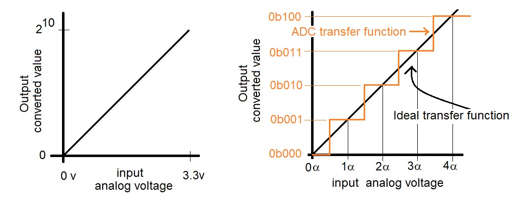
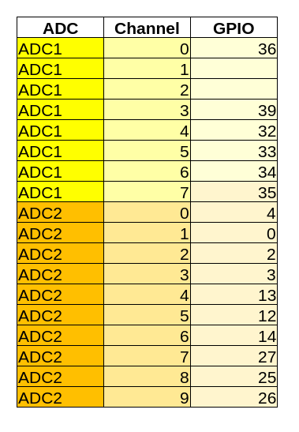

# ADC

Un `ADC (Analog Digital Converter)` è un circuito elettronico integrato utilizzato per convertire segnali analogici, come le tensioni, in forma digitale, come sequenza binaria. Questa operazione è definita `campionamento`.

L'ADC sui nostri ESP32 lavora ad una **tensione di 3.3V** e avendo un intervallo di input di 12 bit, presenta una **risoluzione di 212 = 4096**. Questo significa che, se con un numero reale puoi rappresentare qualunque valore fra 0 e 3.3, con il nostro ADC puoi solamente dividerlo in 4096 parti e rappresentare quelle frazioni della tensione grazie ad un numero binario.

L'errore di misura che si introduce viene definito **errore di quantizzazione**.

 

 

L'ESP32 ha due ADC con 12 bit di accuratezza e un totale di 16 pin suddivisi fra i due ADC. Più precisamente:

!!! warning "Attenzione"
    Se si utilizza la scheda Wifi/Bluetooth integrata nell'ESP32, l'ADC2 e tutte le porte GPIO riconducili ad essa
    diventano inutilizzabili!!!

    Bisogna valutare bene il da farsi...

 
 
 
