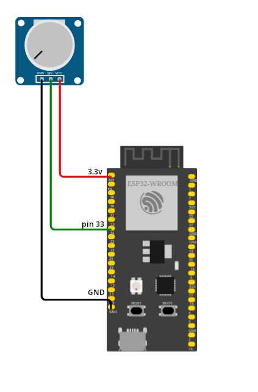

# Potenziometri

Blah blah...



``` py title="Potenziometro"
from machine import Pin,ADC
import time

adc=ADC(Pin(1))
adc.atten(ADC.ATTN_11DB)
adc.width(ADC.WIDTH_12BIT)

while True:
    adcValue = adc.read()
    print("Value:", adcValue)
    time.sleep_ms(100)
```

<br>
<br>
<br>

