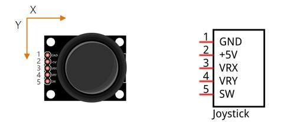
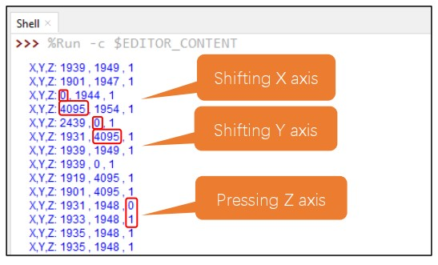

# Joystick con ESP32


Un joystick è un dispositivo di input utilizzato per controllare la 
posizione di un cursore o di un oggetto su uno schermo, 
soprattutto nei contesti di videogiochi, simulatori di volo o altre applicazioni interattive. 
Si tratta di una leva o di un dispositivo simile che può essere spostato in diverse direzioni per controllare il movimento di un cursore o di un'entità virtuale.

I joystick possono avere varie forme e dimensioni, 
ma in genere consistono in una leva che può essere inclinata o spostata 
in diverse direzioni.

Esso fornisce al processore i segnali elettrici relativi alla posizione
di due, l'asse X e l'asse Y. 
Inoltre il joystick ha a disposizione anche l'asse Z 
che ci servirà per indicare la pressione o meno del joystick stesso.



In figura vediamo  i collegamenti elettrici che il nostro joystick richiede:

- Il collegamento al GND
- L'alimentazione a 5V (3.3V per il nostro joystick)
- L'asse X (valori da 0 a 4095)
- L'asse Y (valori da 0 a 4095)
- L'asse Z (valori da 0 a 1)

I due segnali VRX e VRY (per gli assi X e Y) sono due segnali analogici che andranno 
collegati direttamenti a due pin GPIO del componente ESP32 con 
funzione ADC di convertitore Analogico-Digitale.


## Codice

I segnali elettrici collegati ai pin 13 e 14 vengono trasformati in segnali digitali (numeri)
In pratica il valore di tensione in ingresso andrà da un valore di 0V a un valore di 3.3V a seconda della posizione del 
joystick. I corrispondenti valori digitali saranno 0 (per 0V) e 4095 (per 3.3V).

Al pin 12 arriverà in input o un valore basso (0 o LOW) o valore alto (1 o HIGH) 
a seconda se il pin verrà premuto o meno.

Il codice è sotto riportato.

```python
from machine import ADC,Pin
import time

xJoy = ADC(Pin(14)) # ADC sta per Analog-Conversion Converter
yJoy = ADC(Pin(13))
zJoy = Pin(12,Pin.IN,Pin.PULL_UP) # secondo l'asse Z, il joystick è come un pulsante

# impostano la dimensione di X,Y fra 0 e 4095
xJoy.atten(ADC.ATTN_11DB)
yJoy.atten(ADC.ATTN_11DB)
xJoy.width(ADC.WIDTH_12BIT)
yJoy.width(ADC.WIDTH_12BIT)

while True:
  x = xJoy.read()
  y = yJoy.read()
  z = zJoy.value()
  print("X,Y,Z:" , x , "," , y , "," , z )
  time.sleep(1)

```

Quello che dovreste vedere sarà qualcosa del genere:


