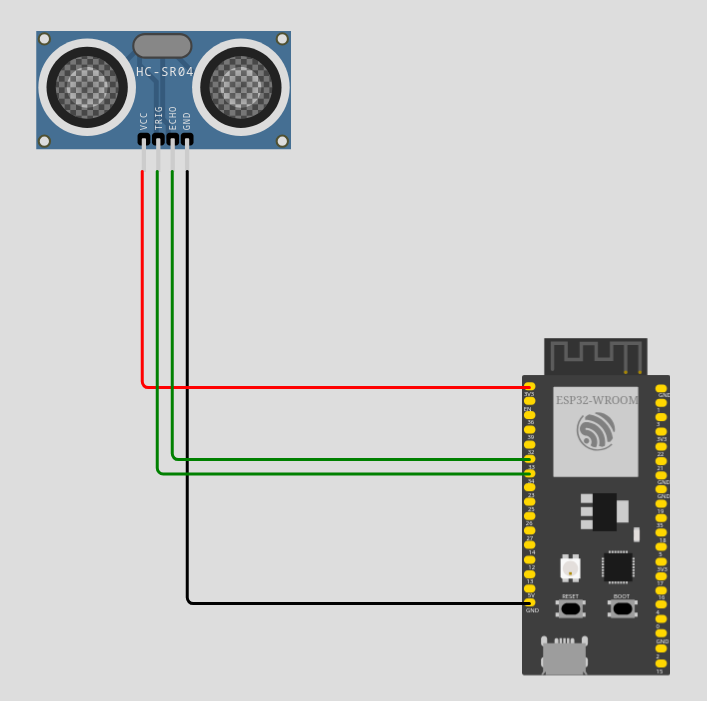

# Ultrasonic Distance Sensors

Il sensore a ultrasuoni utilizza il principio (appunto) degli ultrasuoni per avere informazioni sulla presenza
e posizione di eventuali ostacoli davanti a sè. Inoltre, calcolando l'intervallo di tempo fra l'invio e la
ricezione dell'ultrasuono, è possibile fare una stima della distanza a cui l'ostacolo si trova.

Questo sensore lavora con una tensione di esercizio di 5V (e alla corrente di 12 mA) e riesce a misurare distanze
comprese fra 2 e 200 cm.



``` py title="Esempio con il sensore di distanza"
# sto codice va spiegato passo passo...
from machine import Pin
import time

trigPin=Pin(33,Pin.OUT,0)
echoPin=Pin(32,Pin.IN,0)

soundVelocity = 340
distance = 0

# aspetta due secondi che il sensore si attivi...
time.sleep_ms(2000)

while True:
    trigPin.value(1)
    time.sleep_us(10)
    trigPin.value(0)
    while not echoPin.value():
        pass
    pingStart=time.ticks_us()
    while echoPin.value():
        pass
    pingStop = time.ticks_us()
    pingTime = time.ticks_diff(pingStop,pingStart)
    distance = int(pingTime*soundVelocity//2//10000)
    
    print('Distance: ',distance,'cm' )
    time.sleep_ms(500)
```

<br>
<br>
<br>

