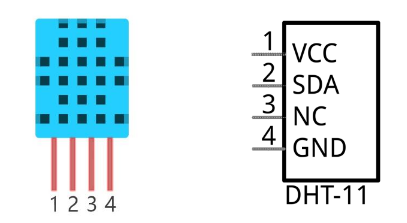

# DHT11 e DHT22

Il sensore DHT11 (o DHT22) è un semplicissimo sensore di input per il calcolo di temperatura e umidità. Il sensore va alimentato e collegato a terra (pin VCC e GND) e poi collegato ad un pin dati di tipo seriale (SDA nel disegno). Il pin NC non va collegato a nulla.



Ecco un semplice codice per utilizzare il sensore e calcolare temperatura e umidità dell'aria.

``` python
from machine import Pin
import dht

# questo in caso di sensore DHT11...
d = dht.DHT11( Pin(4) )
d.measure()
d.temperature() # eg. 23 (°C)
d.humidity()    # eg. 41 (% RH)

# questo per il sensore DHT22...
d = dht.DHT22( Pin(4) )
d.measure()
d.temperature() # eg. 23.6 (°C)
d.humidity()    # eg. 41.3 (% RH)
```


<br>
<br>
<br>
