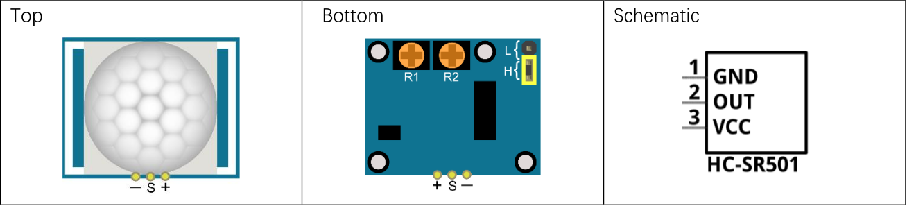

# Motion

Il sensore di movimento a infrarossi è un dispositivo che utilizza infrarossi per rilevare movimenti in una determinata area. 
Il sensore è costituito da un emettitore IR e da un ricevitore sensibile alle stesse frequenze. Quando il ricevitore non riceve segnali dall'emettitore, il sensore rileva la presenza di movimento. 




Il dispositivo lavora ad una corrente di 5V (corrente statica di 65 uA) che va dunque collegata al VCC.
GND va collegato in maniera ovvia al GND del dispositivo, mentre il pin OUT va collegato ad un pin GPIO del microcontrollore.

Il tempo di risposta del sensore è di circa 100 ms. Per modificare questo parametro, è possibile agire sul potenziometro R1 presente nel sensore.

Costruite un semplice circuito con un led e un sensore di movimento a infrarossi e scrivete questo codice per fare in modo che il led si accenda quando il sensore rileva movimento.

``` python
import machine
import time

led = machine.Pin(2, machine.Pin.OUT)
sensor = machine.Pin(4, machine.Pin.IN)

while True:
    if sensor.value() == 1:
        led.on()
    else:
        led.off()
    time.sleep(0.1)
```


<br>
<br>
<br>
