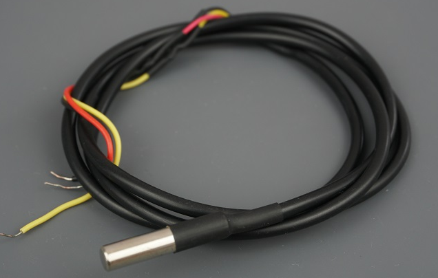
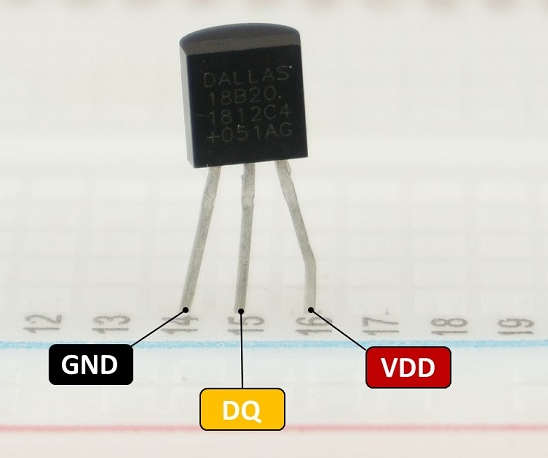
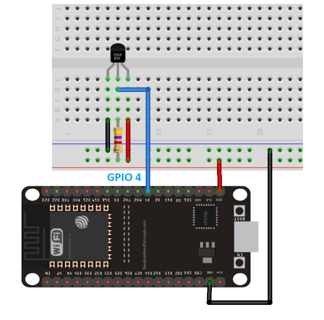

# DS18B20 : Sensore di temperatura    

Il sensore che vedete in figura misurare la temperatura. La sonda è ermetica e quindi può essere lasciata in aria o in acqua o nel terreno. Ad esempio la potete mettere nel terreno per misurare la temperatura del terreno.  
Il sensore DS18B20 è un sensore di temperatura del tipo “one-wire digital sensor”, cioè ha bisogno solo di una linea dati per comunicare le informazioni.
Le altre due linee sono quelle di alimentazione (3.3V) e ground (GND)  

  

Di seguito trovate quello che effettivamente è inserito nel cappuccio di alluminio. Il vero cuore del sensore è proprio quello.  
  

## Circuito elettrico  

> ATTENZIONE:
I collegamenti sui pin dell'ESP32 in figura sono indicativi. Non corrispondono necessariamente a quelli che verranno indicati sul codice. Usate la vostra attenzione e logica per fare il costro collegamento.

> IMPORTANTE che seguiate le seguenti raccomandazioni:  
1-filo nero del disegno deve essere collegato a GND su scheda ESP32. **Sulla versione con cavo, il filo nero corrisponde a GND**.  
2-filo rosso del disegno deve essere collegato a 3,3V su scheda ESP32. **Sulla versione con cavo, il filo rosso... è sempre rosso.**    
3-filo azzurro è quello da collegare a un GPIO (su cui verrà letta la temperatura). **Sulla versione con cavo, il filo da collegare a un GPIO è quello giallo.**  

  


## Il codice  
Il codice riportato sotto esegue le seguenti funzioni:  

- import delle librerie  
- configurazione dei pin (ds_pin = machine.Pin(4))  
- creazione dell'oggetto sensore  
- ricerca dei dispositivi  
- controllo della presenza dei dispositivi  
- selezione del sensore  
- ciclo infinito di lettura  ogni 5 secondi  

```python  
import machine
import onewire
import ds18x20
import time

ds_pin = machine.Pin(4)
ds_sensor = ds18x20.DS18X20(onewire.OneWire(ds_pin))

roms = ds_sensor.scan()

if not roms:
    print("Nessun DS18B20 trovato!")
    raise Exception("Sensore non rilevato")

print("Dispositivo trovato:", roms[0])
rom = roms[0]

while True:
    ds_sensor.convert_temp()
    time.sleep_ms(800)
    
    temp = ds_sensor.read_temp(rom)
    print("Temperatura:", temp, "°C")
    
    time.sleep(5)
```