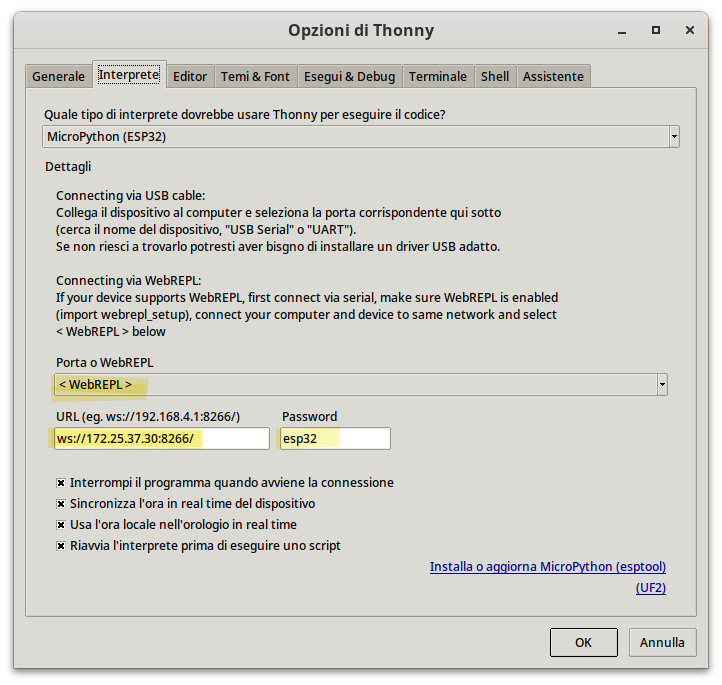
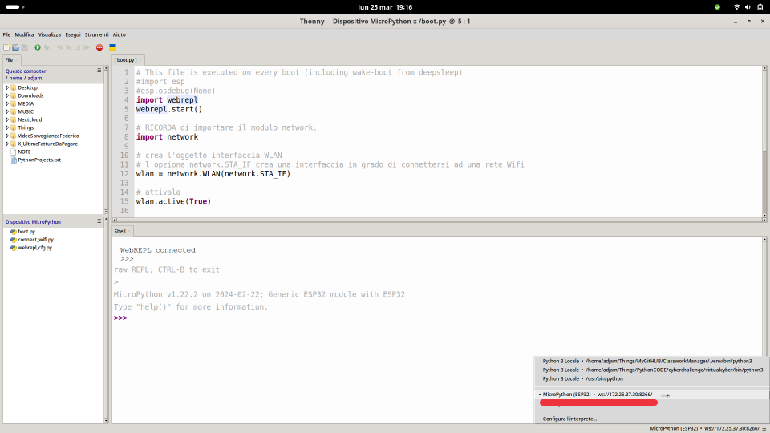

# Connettere l'ESP32

In questa parte del corso andremo ad esplorare le potenzialità di rete presenti in ESP32!
In particolare vedremo:

- come collegare l'ESP32 ad una rete WIFI
- come configurare l'ESP32 per creare una propria rete Wifi, a cui far connettere altri dispositivi.
- come gestire la connettività Bluetooth, presente nel microcontrollore.

Per la gestione del Wifi, si utilizza il modulo `network`, già disponibile nel bundle MicroPython.

Vediamo come

<!-- ################################################################################# -->
## Funzionalità del modulo network


A volte visualizzare un pò di codice ben commentato rende le cose più semplici che tante parole...

<br>

**IMPORTA** il modulo network.

``` python
import network
```

<br>

**CREA** l'oggetto interfaccia WLAN

``` python
# l'opzione network.STA_IF crea una interfaccia in grado di connettersi ad una rete Wifi
wlan = network.WLAN(network.STA_IF)

# l'opzione network.AP_IF crea una interfaccia Access-Point
wlan = network.WLAN(network.AP_IF)
```

<br>

**CONFIGURA**, se necessario, l'oggetto interfaccia WLAN

``` python
# Imposta il nome (si chiama SSID) della rete Wifi
wlan.config(ssid='NomeReteWifi')
# oppure
wlan.config(ssid='NomeReteWifi' , security=3 , key="PasswordReteWifi")
```

<br>

**ATTIVA** l'interfaccia

``` python
wlan.active(True)
```

<br>

**ESEGUI** le operazioni che ritieni necessarie. Qui ho elencato alcuni esempi in ordine sparso...

``` python
# scansiona per individuare le reti Wifi disponibili 
network_list = wlan.scan()

# connette l'interfaccia WLAN alla rete Wifi SSID con chiave KEY
wlan.connect('ssid', 'key')

# controlla SE l'interfaccia è connessa al Wifi.
# Ritorna True/False
wlan.isconnected()

# visualizza la configurazione di rete.
# Ritorna la tupla ( 'IP', 'SubnetMask' , 'gateway' , 'DNS')
wlan.ifconfig()

# configura la rete del dispositivo con le seguenti impostazioni: ( 'IP', 'SubnetMask' , 'gateway' , 'DNS')
wlan.ifconfig( ('IP','SubnetMask','gateway','DNS') )
```

<!-- ################################################################################# -->
## Collegarsi ad una rete Wifi

Vediamo un paio di esempi di collegamento ad una rete wifi da parte del dispositivo ESP32. Nel primo andremo ad acquisire automaticamente le informazioni di rete,
nel secondo andremo ad impostarle manualmente appena possibile.

<br>

``` py title="Connessione ad una rete WIFI ed indirizzamento tramite DHCP"
import network
import time

wlan = network.WLAN(network.STA_IF)
wlan.active(True)

# connette l'interfaccia WLAN alla rete Wifi SSID con chiave KEY
wlan.connect('ssid', 'key')

while not wlan.isconnected():
    print("Connecting...")
    time.sleep(0.5)

print("CONNECTED")
print("Network settings:", wlan.ifconfig())
```


Bene! Adesso impostiamo manualmente le informazioni di rete


``` py title="Connessione ad una rete WIFI con indirizzamento statico"
import network
import time

wlan = network.WLAN(network.STA_IF)
wlan.active(True)

# connette l'interfaccia WLAN alla rete Wifi SSID con chiave KEY
wlan.connect('ssid', 'key')

# configurazione di rete: Questi numeri potrebbero funzionare a scuola, con una opportuna x fra 1 e 254
wlan.ifconfig( ('10.10.12.x','255.255.0.0','10.10.0.1','8.8.8.8') )

while not wlan.isconnected():
    print("Connecting...")
    time.sleep(0.5)

print("CONNECTED")
```


<!-- ################################################################################# -->
## Creare una rete Wifi Ad-hoc

Il codice che presentiamo adesso serve invece a configurare l'interfaccia WLAN per creare una propria rete
Wifi, a cui evetualmente far connettere altri dispositivi.


Vediamo il codice:

``` python
import network

# crea l'oggetto interfaccia WLAN con opzione network.AP_IF
wlan = network.WLAN(network.AP_IF)

# Imposta il nome (si chiama SSID) della rete Wifi
wlan.config(ssid='NomeReteWifi')
# oppure
wlan.config(ssid='NomeReteWifi' , security=3 , key="PasswordReteWifi")

# attivala
wlan.active(True)
```


L'IP predefinito in modalità Access Point è `192.168.4.1`. I client connessi partono da `.2`.


Se voleste elencare i client connessi...

```python
while True:
    clients = ap.status("stations")
    print(f"[WIFI] {len(clients)} stations connected")
    for mac in clients:
        for m in mac:
            smac = f"{m[0]:02x}:{m[1]:02x}:{m[2]:02x}:{m[3]:02x}:{m[4]:02x}:{m[5]:02x}"
            print(f"[WIFI] Station connected: {smac}")

    time.sleep(1)
```

<!-- ################################################################################# -->
## WebREPL

!!! tip

    `REPL` sta per `Read Evaluate Print Loop` e non è nient'altro che il nome tecnico del prompt dei comandi di Python.
    Sarebbe quella cosina dopo i 3 maggiori (`>>>`) che permette il più velocemente possibile di eseguire
    un comando o di controllare il valore di una variabile.


Per accedere al prompt di MicroPython ci sono due modi:

1. collegando l'esp32 tramite USB al PC e interfacciandosi sulla porta virtuale seriale che si crea automaticamente. (Su Windows, sono le porte COM + un numero; su Linux e Mac, le porte ttyUSB + un numero).

2. collegandosi tramite wifi alla cosiddetta `WebREPL`.


Ovviamente noi qui ci occupiamo del secondo caso. Alcune piccole precisazioni preliminari:

- per connetterci alla `WebREPL` dobbiamo prima di tutto essere collegati al wifi (e fino a qui...)

- per instaurare una connessione alla `WebREPL` dell'esp32 occorre un `WebREPL Client`. Neanche a dirlo... `Thonny` ne ha uno incluso al suo interno... senza dover fare nulla!!!


Per utilizzare `WebREPL` dobbiamo prima di tutto configurarlo al meglio! Digitate nel prompt il seguente comando:

``` py
import webrepl_setup
```

Abilitate l'esecuzione automatica all'avvio e scegliete la password di accesso.


!!! note

    Facciamola facile!!! Mettiamo tutti la password `esp32`. 
    
    Ci sarà tempo per fare l'hardening del nostro sistema. Adesso favoriamo la semplicità di configurazione!!!


!!! warning

    Terminata la configurazione webrepl dell'esp32, apparirà nel suo filesystem un file chiamato `webrepl_cfg.py`, contenente, tra le altre cose,
    la password selezionata!
    
    **Non dovete toccarlo, modificarlo, cancellarlo... niente!!!**
    
    Altrimenti tutto risulterà perfettamente inutile...
    
    
Una volta individuato l'IP del vostro sistema riavviate l'esp32 e procedete a connettervi tramite `WebREPL`. Ecco le operazioni da fare su Thonny:

Sulle opzioni...




Infine, quando avete riavviato l'esp32, provate a connettervi selezionando il prompt corretto.




<!-- ################################################################################# -->
## Web Server


Un semplice esempio di web server, per poter studiare e modificare un pochino il codice, per accendere e spegnere il led di sistema dell'ESP32


``` python
# THE led
import machine
led = machine.Pin(5, machine.Pin.OUT)
led.off()

# THE web server
import socket

# ....
server = socket.socket(socket.AF_INET, socket.SOCK_STREAM)
server.bind(('0.0.0.0', 80))
server.listen(8) # max number of simultaneous connections
server.setblocking(False)

while True:
    conn, addr = server.accept()
    print('Got a connection from ', str(addr))
    
    request = str( conn.recv(1024) )
    request_line = request.split('\n')[0]
    
    if 'led=on' in request_line:
        print('LED ON')
        led.on()
    if 'led=off' in request_line:
        print('LED OFF')
        led.off()
    
    html = ""
    html += '<h1>Web LED</h1>' 
    html += '<a href="/?led=on"><button class="button">ON</button></a>'
    html += '<a href="/?led=off"><button class="button button2">OFF</button></a>'
    
    conn.send('HTTP/1.1 200 OK\n')
    conn.send('Content-Type: text/html\n')
    conn.send('Connection: close\n\n')
    conn.sendall(html)
    conn.close()
```

<!-- ################################################################################# -->
## Async Web Server


Questo codice è sperimentale. L'ho scritto durante le vacanze di Natale... 


``` python
import asyncio
import socket

async def handle_client(client):
    loop = asyncio.get_event_loop()

    request = (await loop.sock_recv(client, 1024)).decode('utf8')
    request_line = request.split('\n')[0]
    print("request line:", request_line)
    
    reply = ''
    reply += 'HTTP/1.1 200 OK\n'
    reply += 'Content-Type: text/html\n'
    reply += 'Connection: close\n\n'
    
    if 'led=on' in request_line:
        print('LED ON')
    if 'led=off' in request_line:
        print('LED OFF')

    reply += '<h1>Web LED</h1>' 
    reply += '<a href="/?led=on"><button class="button">ON</button></a>'
    reply += '<a href="/?led=off"><button class="button button2">OFF</button></a>'
    reply += '\n'
    
    await loop.sock_sendall(client, reply.encode('utf8'))
    client.close()

async def run_server():
    server = socket.socket(socket.AF_INET, socket.SOCK_STREAM)
    server.bind(('0.0.0.0', 8080))
    server.listen(8) # max number of simultaneous connections
    server.setblocking(False)

    loop = asyncio.get_event_loop()

    while True:
        client, addr = await loop.sock_accept(server)
        loop.create_task(handle_client(client))

# -----------------------------------------------------------------------------
if __name__ == "__main__":
    asyncio.run(run_server())
```


<!-- ################################################################################# -->
## Bluetooth

Quando arriva, arriva...


<br>
<br>
<br>

