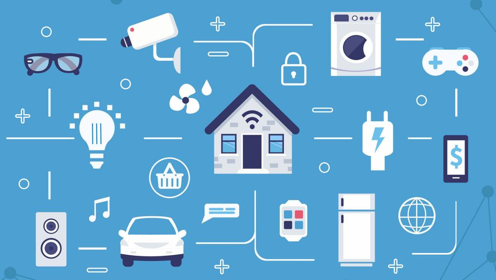

# ESP32

ESP32 è un microcontrollore a basso costo, con Wifi e bluetooth integrato, oltre che un'interfaccia programmabile per la gestione di vari sensori collegati ad esso. 

!!! note "MicroControllore"

    Un **MicroControllore (MCU)** è un dispositivo elettronico integrato in un unico circuito, 
    in grado di eseguire in maniera autosufficiente un determinato software.
    
    Si presenta come alternativa al **MicroProcessore (CPU)** che è un dispositivo con maggiore potenza di calcolo, ma con la
    continua necessità di interfacciarsi con periferiche esterne, tipo RAM, ROM, etc.. per la selezione del software da eseguire.

Un microcontrollore, una volta che vi viene caricato un software da eseguire, lo esegue all'infinito dal momento in cui viene acceso al momento in cui esso viene spento.
È dunque la soluzione ideale per la realizzazione di qualsiasi dispositivo elettronico: una calcolatrice, la macchina del caffè, una lavatrice moderna, la stampante 3D... sono tutti
oggetti realizzati tramite MCU!

Risulta dunque evidente quanto i MicroControllori rappresentino uno dei mattoni fondamentali dell'evoluzione dell'informatica e delle telecomunicazioni 
conosciuta con il nome di <a href="https://it.wikipedia.org/wiki/Internet_delle_cose" target="_blank">Internet of Things</a>.

## Specifiche ESP32 in dotazione a scuola

Premessa: queste info qui sotto sono *roba da nerd*... leggetele con il rischio di appassionarvi a certe precisazioni!!

La ESP32 in dotazione a scuola è una ESP32-WROOM-32 LOIN32 (se avete gli occhi buoni... lo potrete leggere sul dispositivo stesso):

- lavora a 3.3 Volt
- Consuma fino a 500mA
- Il controllore **ESP32-WROOM-32**, incredibilmente a 32 bit, è dual-core basato su Xtensa LX6
- Lavora a 240 Mhz
- La memoria predefinita: 32 Mb ROM a 40 Mhz
- **WiFi**: 802.11 b/g/n, fino a 150 Mbps
- **Bluetooth** 4.2 BR/EDR e BLE
- Ricevitore NZIF
- Encryption: WAPI, WEP, TKIP, AES, SHA-2, RSA, ECC
- Analog inputs (ADC): 12, 12-bit
- Analog outputs (DAC): 2, 8-bit
- Interfaces: **GPIO**, UART, I2C, I2S, SPI, PWM, Touch, Ethernet MAC, SDcard, SDIO, IrDA
- UART baud rate: up to 5MBit/s
- Programmable GPIO5 **output LED**
- Supporta: ARDUINO, NodeMCU, **MicroPython**, ESP-IDF

<!-- ################################################################################# -->

 
 
 

