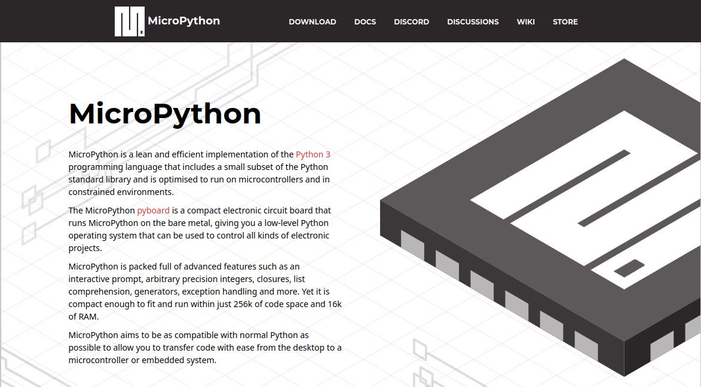

# MicroPython 



MicroPython è una implementazione del linguaggio Python progettata per essere eseguita sui microcontrollori. Uno degli obiettivi del progetto è quello
di ricercare la miglior compatibilità possibile con il Python *normale*, per semplificare l'apprendimento e la realizzazione di software che colleghi
i due mondi `desktop` e `sistemi embedded`.

Il sito ufficiale di MicroPython è (incredibilmente): <a href="https://micropython.org" target="_blank">https://micropython.org</a>

Poiché l'interprete va eseguito direttamente sul microcontrollore, va scaricato dal sito l'interprete adatto e installato su di esso. <br>
Vediamo come!


!!! tip "Domanda"

    Sapete qual è l'editor Python più semplice ed adatto per la programmazione di microcontrollori basati su MicroPython??
    
    Se avete risposto <a href="https://thonny.org" target="_blank">Thonny</a>, avete dato la risposta esatta!!!


## MicroPython Firmware per ESP32

Per caricare il firmware MicroPython occorre prima scaricarlo dal sito ufficiale!

- Aprite il sito ufficiale <a href="https://micropython.org" target="_blank">MicroPython</a>;
- Cliccate sulla voce `Download`;
- Scendete sull'elenco dei microcontrollori fino a trovare `ESP32 - EspressIf`
- Scaricate l'ultimo file binario disponibile fra le `Firmware Releases` (attualmente, la versione `v1.19.1`)

Adesso un attimo di riposo... siete praticamente già ad un terzo del lavoro!!!

La seconda fase consiste semplicemente nel collegare il microcontrollore ESP32 al nostro computer tramite un cavo USB.<br>
Mi immagino che siate già riusciti nell'impresa... pronti per l'ultima fase:

- Aprite *Thonny*
- Dal menù *ESEGUI*, seleziona *CONFIGURA L'INTERPRETE*
- Seleziona *MicroPython (ESP32)* (vedi figura sotto)


Il video qui sotto è... a prova di studente!!! Procedete come descritto. I prof vi controllano dall'alto :smile:

- VIDEO


## "Hello, World!"

Connetti il tuo ESP32 al computer e cambia l'interprete Python a `MicroPython (ESP32)`.

Scrivi il tuo difficilissimo codice:

``` py
print("Hello, World!")
```

e salva il file come `HelloWorld.py` dentro la memoria dell'ESP32. Per farlo:

Clicca sul pulsante APRI:

--- immagine ---

Seleziona `MicroPython device`

--- immagine ---

Esegui il codice, premendo `F5` oppure selezionando l'azione `Run current script`

Se vuoi fare in modo che il tuo dispositivo esegua il tuo codice continuamente non appena viene acceso (così come fanno tutti i dispositivi: televisori, forni, macchine del caffè, etc...) apri il file `boot.py` e modificalo come segue:

``` py
# codice per eseguire il file HelloWord.py
```

<br>
<br>
<br>

