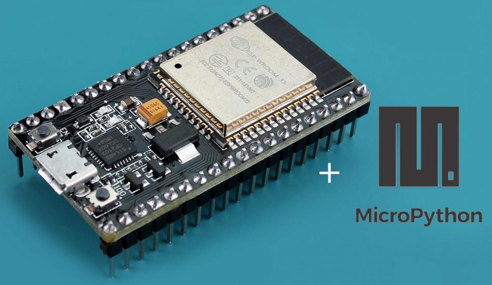

---
hide:
  - navigation
  - toc
  - footer
---

# MicroPython && ESP32

Un semplice corso per parlare di:

- **il microcontrollore ESP32**: un dispositivo programmabile alla nostra portata

- **L'interprete MicroPython**: un interprete Python ridotto, adatto per i microcontrollori

- **Thonny**: il nostro editor Python preferito!!! Qui utilizzato (anche) per interagire con un microcontrollore

- **sensori ed elettronica**: vuoi implementare un semaforo? Una calcolatrice? Una stazione meteo? Un allarme? Dovrai far interagire alcuni sensori con il tuo microcontrollore e dovrai gestirli tramite il tuo codice. Sarà divertente!!!

Cominciamo!

 
 
 

