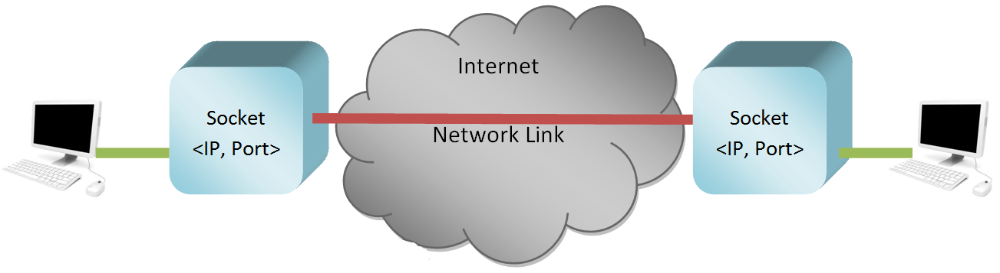

# Socket Programming


I socket sono oggetti software gestiti dal Sistema Operativo. Sono gli unici responsabili per qualunque connessione di rete.
Anzi... più precisamente una connessione di rete non è altro che uno scambio di dati fra due socket! E chi chiede al sistema operativo
di creare i socket? Le applicazioni!!!

I socket permettono anche ai dispositivi di veicolare *contemporaneamente* più connessioni logiche (ad esempio, due schede di un browser aperte)
attraverso un'unica connessione fisica! Più precisamente, per ogni dispositivo fisico di connessione alla rete sono disponibili 65.536 porte logiche 
per la possibile creazione di altrettanti socket!

<br>



<br>

> Come si evince chiaramente dalla figura, **Ogni socket si individua grazie alla coppia di informazioni: `IP`, `PORTA LOGICA`**.
> 
> Ogni connessione alla rete viene individuata univocamente (nell'unità di tempo) dalla coppia di socket 
> che fanno da mittente e destinatario della stessa.
>

Il livello di trasporto può fornire due tipi di servizi, definiti in due protocolli diversi:

- **Il protocollo TCP**, per le connessioni punto a punto (1 a 1); connesso e affidabile
- **Il protocollo UDP** per le connessioni semplici (anche broadcast e multicast) senza alcuna sovrastruttura: non connesso e non affidabile.

Ok... la teoria la sappiamo! Vediamo il codice adesso.


## Socket in Python

Come dicevamo, i socket sono oggetti software gestiti dal Sistema Operativo e invocati dalle applicazoini. Come si crea un socket in Python??

```
import socket

# Oggetto Socket TCP
tcp_socket = socket.socket(socket.AF_INET, socket.SOCK_STREAM)

# Oggetto Socket UDP
udp_socket = socket.socket(socket.AF_INET, socket.SOCK_DGRAM)
```

Anche qui... non mi sembra complicato :)

Faremo adesso una prova di comunicazione client-server tramite il protocollo UDP.


## Comunicazione client/server UDP in Python

Vediamo il codice che crea un server con il protocollo UDP. Questo semplice programma si mette in attesa di comunicazioni. Poi a seconda del messaggio arrivato
risponde OK se il numero di lettere arrivate è pari, ERR se sono dispari.

``` python title="UDP Server in Python"
import socket
import time

localIP = "192.168.110.200"  # Qui ci va il tuo IP, come stringa
localPort = 20000            # Qui ci va una porta (> 1024), come intero

# UDP Socket Object
udp_socket = socket.socket(socket.AF_INET, socket.SOCK_DGRAM)

# Bind to address and ip
udp_socket.bind( (localIP, localPort) )

print("UDP server up and listening")

# Listen for incoming datagrams
while True:
    message,address = udp_socket.recvfrom(1024)

    time.sleep(0.1)
    print("Message from Client:", message.decode() )
    print("Client IP Address:", address)

    msgFromServer = "OK"
    if len(message) % 2 == 1:
        msgFromServer = "Err"
    bytesToSend = str.encode(msgFromServer)
    
    # Sending a reply to client
    udp_socket.sendto(bytesToSend, address)
```

<br>

Ovviamente abbinato al server, che deve essere in esecuzione, ci va un client che deve tentare la connessione e l'invio allo stesso. Ecco il codice che permette
di inviare al server un messaggio qualunque.

<br>


``` python title="UDP Client in Python"
import socket
import time

Server_IP   = "192.168.110.200"  # Qui ci va l'IP del dispositivo che esegue il tuo server, come stringa
Server_PORT = 20000              # Qui ci va la porta del tuo server (la devi sapere), come intero

MESSAGE = input("text to send: ")

print("UDP target IP: ", Server_IP)
print("UDP target port: ", Server_PORT)
print("message: ", MESSAGE)

# UDP Socket Object
udp_socket = socket.socket(socket.AF_INET, socket.SOCK_DGRAM)
udp_socket.sendto(MESSAGE.encode(), (Server_IP, Server_PORT))

time.sleep(0.1)

message,address = udp_socket.recvfrom(1024)

print("Reply from Server:", message.decode() )
print("Server IP Address:", address)
```

Adesso basta solo provare :)


## Comunicazione client/server TCP in Python

TCP è un protocollo ben più complicato di UDP! Vi espongo le differenze fondamentali:

- il socket del server, **prima** di poter ricevere connessioni, dovrà porsi in modalità `listen`
- il client, **prima** di poter inviare dati al server, dovrà stabilire una `connessione` con il socket del server
- Una volta stabilita la connessione, i dati tra i due socket saranno veicolati tramite essa, con i metodi `sendall` e `recv`
- I dati di passaggio nella connessione sono per forza di cose ordinati! (A questo ci pensa TCP... noi non dobbiamo fare nulla. Solo sapere...)
- Alla fine dello scambio di dati la connessione va chiusa con il metodo `close` **da parte di entrambi i socket**!!!

Vediamo un esempio di codice che implementa un semplice client e un semplice server basati su TCP. Il client potrà inviare qualsiasi messaggio vuole, mentre il server
risponderà comunque *ok*. Se il client invia la stringa *close* il server saluta con *bye* e chiude la connessione.


``` python title="Simple Python TCP server" hl_lines="8 9 13 19 23"
import socket

HOST = "127.0.0.1"  # Standard loopback interface address (localhost)
PORT = 65432        # Port to listen on (non-privileged ports are > 1023)

tcp_socket = socket.socket(socket.AF_INET, socket.SOCK_STREAM)

tcp_socket.bind( (HOST, PORT) )
tcp_socket.listen()

print(f"listening on socket ({HOST}:{PORT})...")

conn, addr = tcp_socket.accept()

if conn:
    print(f"Connected by {addr}")
    
    while True:
        data = conn.recv(1024)
        message = data.decode()
        print("Received:", message)
        if message == "close":
            conn.sendall( "bye".encode() )
            break
        conn.sendall( "OK".encode() )
        
conn.close()
```

Qui sotto invece trovate il codice che implementa il client TCP.


``` python title="Simple Python TCP client" hl_lines="7 12 13"
import socket

HOST = "127.0.0.1"  # The server's hostname or IP address
PORT = 65432  # The port used by the server

tcp_socket = socket.socket(socket.AF_INET, socket.SOCK_STREAM)
tcp_socket.connect( (HOST, PORT) )

while True:
    message = input("Message to send: ")

    tcp_socket.sendall( message.encode() )
    data = tcp_socket.recv(1024)
    message = data.decode()
    print(f"Received: {data.decode()}")

    if message == "bye":
        tcp_socket.close()
        break
```

<br>
<br>
<br>

